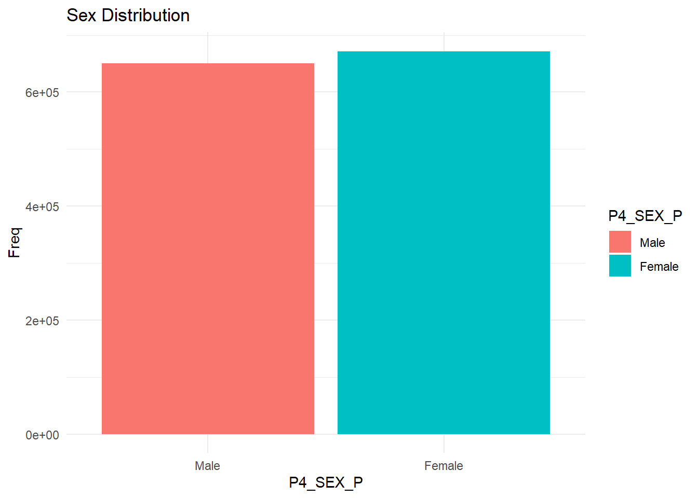
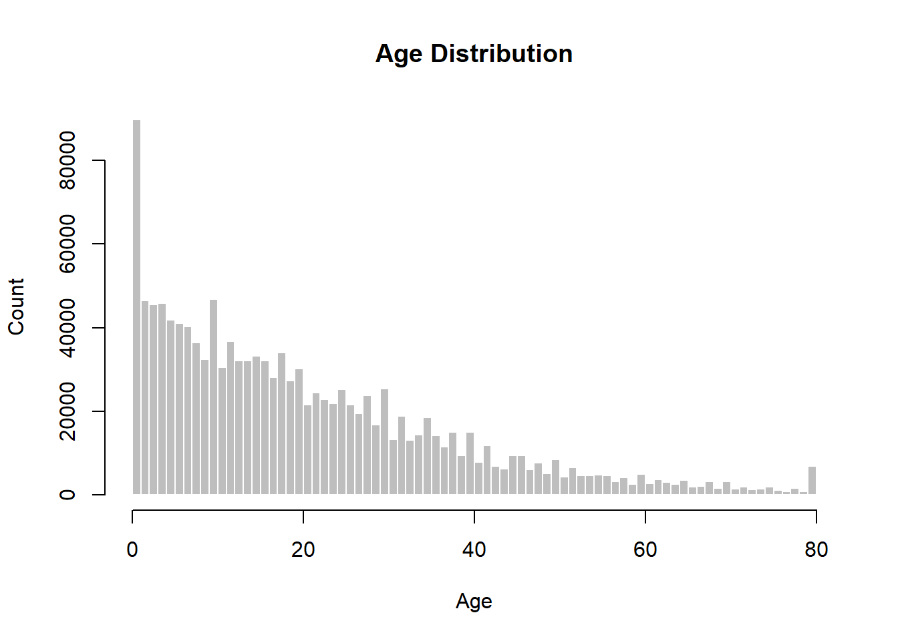
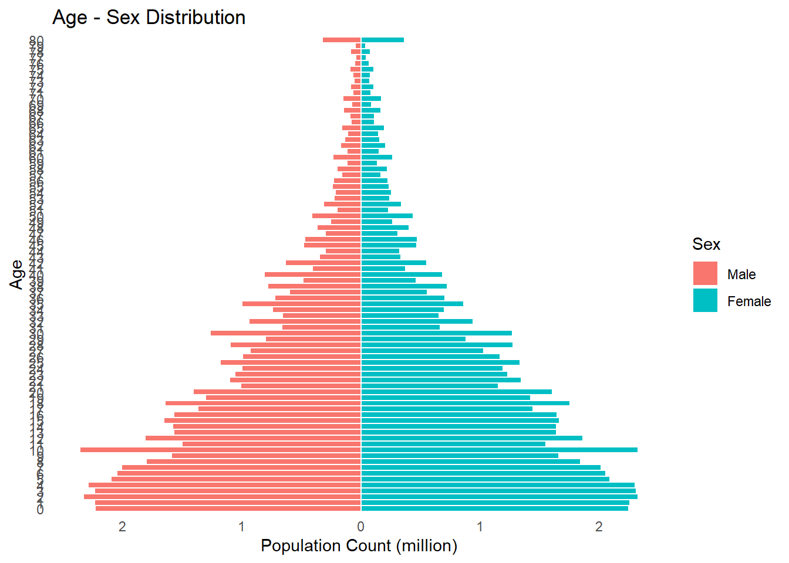
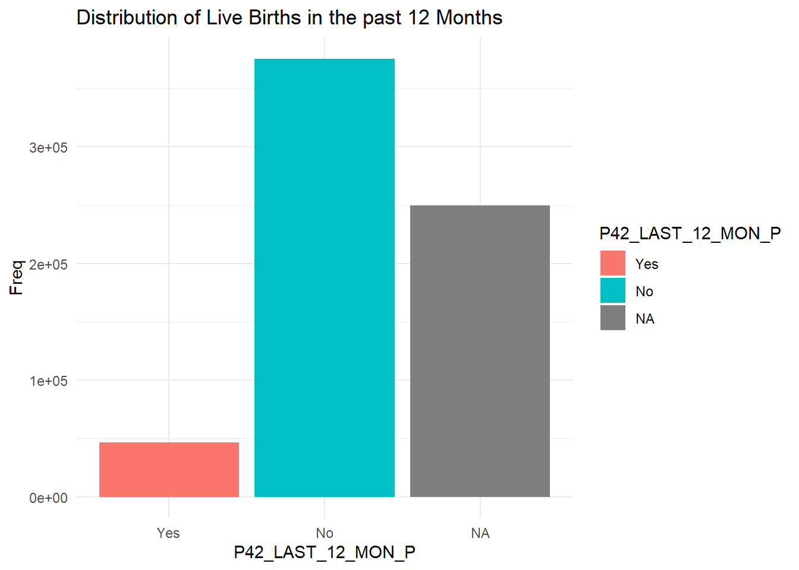
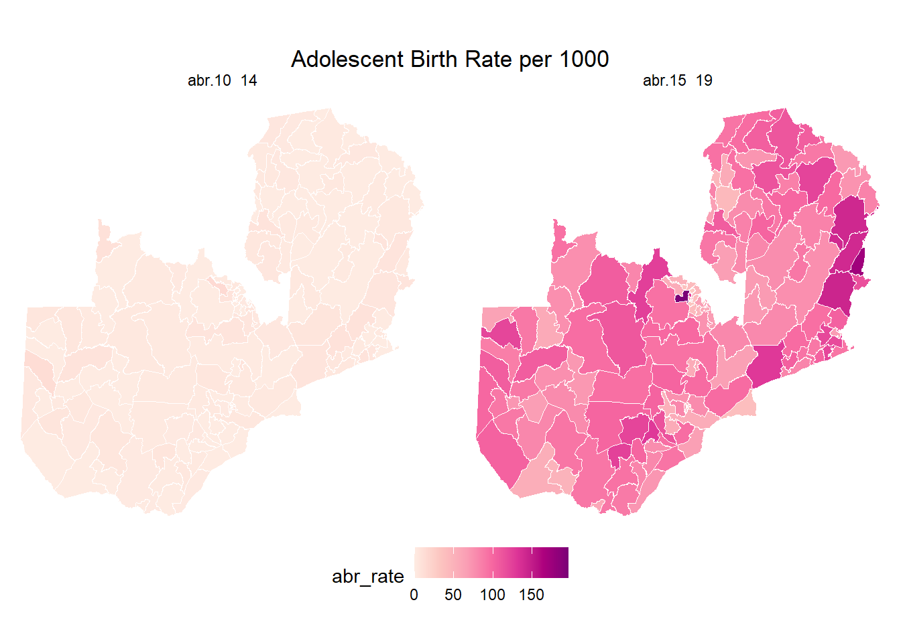
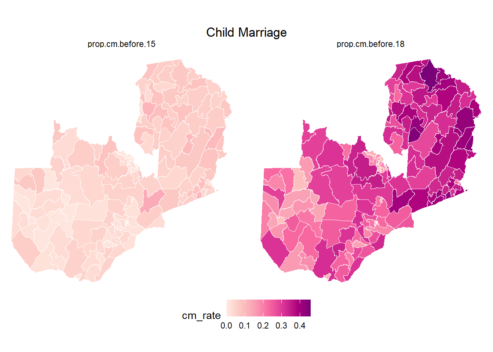
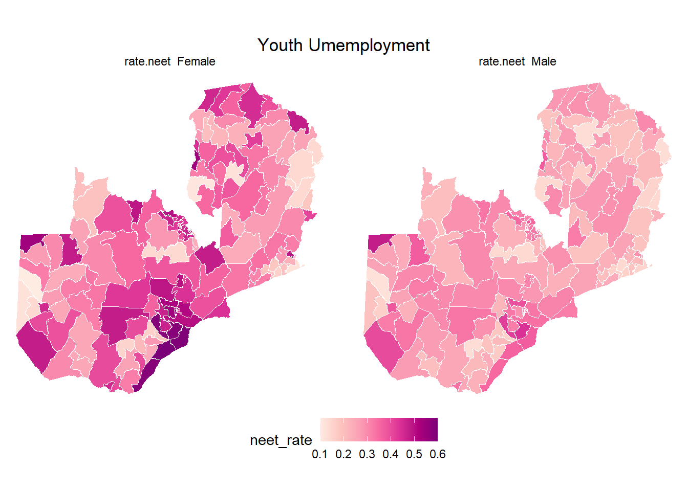
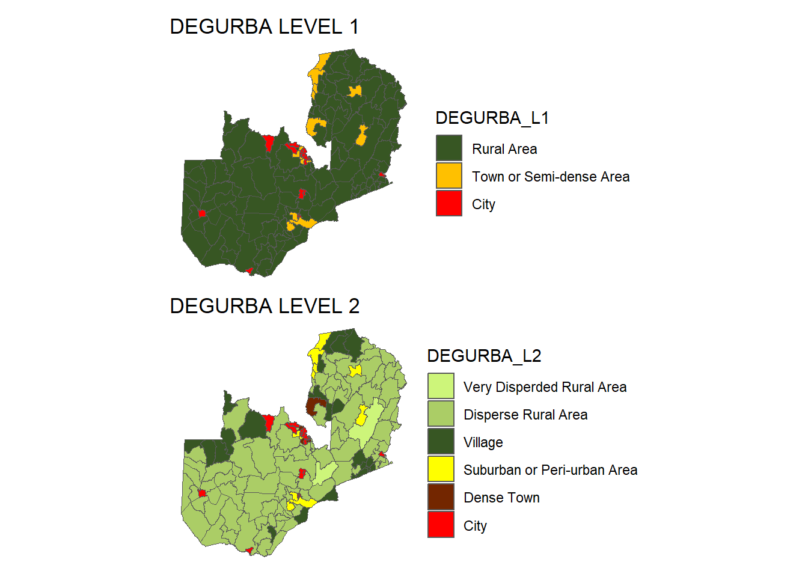

## INTRODUCTION

This R markdown template will take through computation of some SDG 3, 5 and 8 key indicators namely;

-   SDG Indicator 3.7.2: Adolescent birth rate (aged 10–14 years; aged 15–19 years) per 1,000 women in that age group.

-   SDG INDICATOR 5.3.1: Proportion of women aged 20–24 years who were married or in a union before age 15 and before age 18.

-   SDG INDICATOR 8.6.1: Proportion of youth (aged 15-24 years) not in education, employment or training.

## LOAD LIBRARIES


``` r
if(!require("pacman")) install.packages("pacman")

pacman::p_load(tidyverse, haven, forcats, gt, sf, ggrepel, patchwork)
```

## LOAD DATA

This represent 10% from the Zambia 2010 population and houses census data whose sole purpose is for this exercise.


``` r
demographics <- haven::read_sav("input/DataExercise/SPSS files/DemographicsDIST.sav")

constituency_shape <- sf::read_sf("input/TUC/zambia_constituency_reproj_pop_GHS-DU-TUC.shp")
```

## DATA DESCRIPTION & EXPLORATION

**Description**

There are two main datasets used in this exercise.

-   **demographics** : 10% of Zambia 2010 individual census data with 1,321,973 records and 92 variables. This will be used to compute the SDG indicators using variables such as age, sex, activity in the past 12 months, child bird in the past 12 months and constituency.

-   **constituency_shape** : Zambia constituency boundaries (admin 4) with 150 records and 34 variables including information on the DEGURBA classification. This will be used to map the SDG indicators computed from the demographic data and then later to disaggregate the indicators my DEGURBA.

**Exploration**

In this section, we are exploring the key variables that will be used in this exercise. These variables are

-   *P4_SEX_P = Sex*


``` r
# Sex unique values
demographics$P4_SEX_P |> str()
```

```
##  dbl+lbl [1:1321973] 2, 2, 2, 2, 1, 2, 2, 1, 2, 2, 2, 2, 1, 1, 2, 1, 1, 1, ...
##  @ label        : chr "Sex"
##  @ format.spss  : chr "F1.0"
##  @ display_width: int 10
##  @ labels       : Named num [1:2] 1 2
##   ..- attr(*, "names")= chr [1:2] "Male" "Female"
```

``` r
# Sex distribution
demographics |>
  mutate(P4_SEX_P = as_factor(P4_SEX_P)) |>
  dplyr::group_by(P4_SEX_P) |>
  count(name = "Freq") |>
  tibble::tibble() |>
  ggplot2::ggplot() +
  ggplot2::geom_bar(aes(x = P4_SEX_P, fill = P4_SEX_P, y = Freq), 
                    stat = "identity") +
  ggplot2::labs(title = "Sex Distribution") +
  ggplot2::theme_minimal()
```



-   *P5_AGE_P = Age*


``` r
# Age distribution
demographics$P5_AGE_P |> hist(col = "grey", 
                              main = "Age Distribution",
                              xlab = "Age", 
                              ylab = "Count", 
                              border = "white", 
                              breaks = length(unique(demographics$P5_AGE_P)))
```



``` r
# Age distribution by Sex
demographics |>
  group_by(P4_SEX_P, P5_AGE_P) |>
  summarise(pop_count = n()/10000) |>
  mutate(
    pop_count = case_when(
      P4_SEX_P == 1 ~ -pop_count,
      P4_SEX_P == 2 ~ pop_count
    ),
    sex_label = factor(P4_SEX_P, levels = c(1, 2), labels = c("Male", "Female")),
    age_factor = factor(P5_AGE_P, levels = sort(unique(P5_AGE_P)))
  ) |>
  ggplot2::ggplot(aes(x = pop_count, y = age_factor, fill = sex_label)) +
  ggplot2::geom_bar(stat = "identity", width = 1, , color = "white") +
  ggplot2::scale_x_continuous(labels = abs) +
  ggplot2::labs(title = "Age - Sex Distribution",
                x = "Population Count (million)", 
                y = "Age", 
                fill = "Sex") +
  ggplot2::theme_minimal() +
  ggplot2::theme(
    panel.grid = element_blank()
  )
```



-   *P42_LAST_12_MON_P = Live births in the past 12 months*


``` r
# Unique values
demographics$P42_LAST_12_MON_P |> str()
```

```
##  dbl+lbl [1:1321973]  2,  2,  2,  2, NA,  2,  2, NA,  2,  2,  2,  2, NA, NA...
##  @ label        : chr "Any live births in last 12 months?"
##  @ format.spss  : chr "F1.0"
##  @ display_width: int 19
##  @ labels       : Named num [1:2] 1 2
##   ..- attr(*, "names")= chr [1:2] "Yes" "No"
```

``` r
# distribution of live births in females
demographics |>
  dplyr::filter(P4_SEX_P == 2) |>
  mutate(P42_LAST_12_MON_P = as_factor(P42_LAST_12_MON_P)) |>
  dplyr::group_by(P42_LAST_12_MON_P) |>
  count(name = "Freq") |>
  tibble::tibble() |>
  ggplot2::ggplot() +
  ggplot2::geom_bar(aes(x = P42_LAST_12_MON_P , fill = P42_LAST_12_MON_P, y = Freq), 
                    stat = "identity") +
  ggplot2::labs(title = "Distribution of Live Births in the past 12 Months") +
  ggplot2::theme_minimal()
```



-   *P32_ACTIVITY_LAST_12_MONTHS_P = Activity in the last 12 months*


``` r
# Unique Activities
demographics$P32_ACTIVITY_LAST_12_MONTHS_P |> unique()
```

```
## <labelled<double>[12]>: Activity last twelve months
##  [1] NA  7 10  2  8  9  4  6 11  3  1  5
## 
## Labels:
##  value                                        label
##      1                   Worked - Paid non seasonal
##      2                 Worked - Unpaid non seasonal
##      3                       Worked - Paid seasonal
##      4                     Worked - Unpaid seasonal
##      5                                     On Leave
##      6 Unpaid work on household holding or business
##      7                  Unemployed and seeking work
##      8       Not seeking work but availabe for work
##      9                Full time housewife/homemaker
##     10                            Full time student
##     11     Not available for work for other reasons
```

``` r
# activity distribution
demographics |>
  mutate(P32_ACTIVITY_LAST_12_MONTHS_P = as_factor(P32_ACTIVITY_LAST_12_MONTHS_P),
         P4_SEX_P = as_factor(P4_SEX_P)
         ) |>
  dplyr::group_by(P32_ACTIVITY_LAST_12_MONTHS_P, P4_SEX_P) |>
  count(name = "Freq") |>
  ggplot2::ggplot() +
  ggplot2::geom_bar(aes(y = P32_ACTIVITY_LAST_12_MONTHS_P, 
                        fill = P4_SEX_P, 
                        x = Freq), 
                    stat = "identity") +
  ggplot2::theme_minimal() +
  ggplot2::theme(
    panel.grid = element_blank()
  ) +
  ggplot2::labs(
    title = "Frequency of Activities in the past 12 month by Sex",
    y = "Activity"
  )
```


-   *CONST_P = Constituency (Admin 4)*


``` r
constituency_shape |>
  ggplot2::ggplot() +
  ggplot2::geom_sf(color = "black") +
  ggrepel::geom_text_repel(data = constituency_shape, 
                            aes(label = NAME1_, geometry = geometry),
                            stat = "sf_coordinates") +
  ggplot2::labs(title = "Zambia Constituencies 2010") +
  ggplot2::theme_void()
```


## SUSTAINABLE DEVELOPMENT GOALS (SDG) CALCULATION

### SDG 3 : Good Health and Well Being

#### SDG TARGET 3.7: By 2030, ensure universal access to sexual and reproductive health-care services, including for family planning, information and education, and the integration of reproductive health into national strategies and programmes.

##### **SDG Indicator 3.7.2: Adolescent birth rate (aged 10–14 years; aged 15–19 years) per 1,000 women in that age group**

adolescent_birth_rate_10_14 = (number of women aged 10 - 14 with live birth in the past 12 months / number of women aged 10 - 14)\*1000

adolescent_birth_rate_14_19 = (number of women aged 14 - 19 with live birth in the past 12 months / number of women aged 14 - 19)\*1000

**Input Variables Definition:**

-   *P4_SEX_P = SexP4_SEX_P*

-   *P5_AGE_P = Age*

-   *P42_LAST_12_MON_P = Live births in the past 12 months*

-   *CONST_P = Constituency (Admin 4)*

**Output Variables Definition:**

-   *total.ado.10_14 = Total female adolescents aged 10 to 14*

-   *total.ado.15_19 = Total female adolescents aged 15 to 19*

-   *total.ado.birth.10_14 = Total female adolescents aged 10 to 14 with live birth in the past 12 months*

-   *total.ado.birth.15_19 = Total female adolescents aged 15 to 19 with live birth in the past 12 months*

-   *abr.10_14 = Adolescent aged 10 to 14 birth rate*

-   *abr.15_19 = Adolescent aged 15 to 19 birth rate*

**Methodology:**

1- Filter the Sex to Female by using the P4_SEX_P == 2

2- Group by the constituency

3- Compute summary statistics

**Adolescent Birth Rate by Constituency**


``` r
adolescent_birth_rate <- 
  demographics |>
  dplyr::filter(P4_SEX_P == 2) |>
  dplyr::group_by(CONST_P) |>
  dplyr::summarise(
    total.ado.10_14 = sum(dplyr::between(P5_AGE_P, 10, 14), na.rm = TRUE),
    total.ado.15_19 = sum(dplyr::between(P5_AGE_P, 15, 19), na.rm = TRUE),
    total.ado.birth.10_14 = sum(dplyr::between(P5_AGE_P, 10, 14) &
                                  P42_LAST_12_MON_P == 1, na.rm = TRUE),
    total.ado.birth.15_19 = sum(dplyr::between(P5_AGE_P, 15, 19) &
                                  P42_LAST_12_MON_P == 1, na.rm = TRUE),
    abr.10_14 = round((total.ado.birth.10_14 / total.ado.10_14) * 1000,2),
    abr.15_19 = round((total.ado.birth.15_19 / total.ado.15_19) * 1000,2)
  ) |>
  dplyr::mutate(
    CONST_P_name = forcats::as_factor(CONST_P)
  ) |>
  dplyr::select(
    CONST_P_name,
    everything()
  ) 

# Print table
adolescent_birth_rate |>
  head() |>
  gt::gt()
```

```{=html}
<div id="hmsxvqazmf" style="padding-left:0px;padding-right:0px;padding-top:10px;padding-bottom:10px;overflow-x:auto;overflow-y:auto;width:auto;height:auto;">
<style>#hmsxvqazmf table {
  font-family: system-ui, 'Segoe UI', Roboto, Helvetica, Arial, sans-serif, 'Apple Color Emoji', 'Segoe UI Emoji', 'Segoe UI Symbol', 'Noto Color Emoji';
  -webkit-font-smoothing: antialiased;
  -moz-osx-font-smoothing: grayscale;
}

#hmsxvqazmf thead, #hmsxvqazmf tbody, #hmsxvqazmf tfoot, #hmsxvqazmf tr, #hmsxvqazmf td, #hmsxvqazmf th {
  border-style: none;
}

#hmsxvqazmf p {
  margin: 0;
  padding: 0;
}

#hmsxvqazmf .gt_table {
  display: table;
  border-collapse: collapse;
  line-height: normal;
  margin-left: auto;
  margin-right: auto;
  color: #333333;
  font-size: 16px;
  font-weight: normal;
  font-style: normal;
  background-color: #FFFFFF;
  width: auto;
  border-top-style: solid;
  border-top-width: 2px;
  border-top-color: #A8A8A8;
  border-right-style: none;
  border-right-width: 2px;
  border-right-color: #D3D3D3;
  border-bottom-style: solid;
  border-bottom-width: 2px;
  border-bottom-color: #A8A8A8;
  border-left-style: none;
  border-left-width: 2px;
  border-left-color: #D3D3D3;
}

#hmsxvqazmf .gt_caption {
  padding-top: 4px;
  padding-bottom: 4px;
}

#hmsxvqazmf .gt_title {
  color: #333333;
  font-size: 125%;
  font-weight: initial;
  padding-top: 4px;
  padding-bottom: 4px;
  padding-left: 5px;
  padding-right: 5px;
  border-bottom-color: #FFFFFF;
  border-bottom-width: 0;
}

#hmsxvqazmf .gt_subtitle {
  color: #333333;
  font-size: 85%;
  font-weight: initial;
  padding-top: 3px;
  padding-bottom: 5px;
  padding-left: 5px;
  padding-right: 5px;
  border-top-color: #FFFFFF;
  border-top-width: 0;
}

#hmsxvqazmf .gt_heading {
  background-color: #FFFFFF;
  text-align: center;
  border-bottom-color: #FFFFFF;
  border-left-style: none;
  border-left-width: 1px;
  border-left-color: #D3D3D3;
  border-right-style: none;
  border-right-width: 1px;
  border-right-color: #D3D3D3;
}

#hmsxvqazmf .gt_bottom_border {
  border-bottom-style: solid;
  border-bottom-width: 2px;
  border-bottom-color: #D3D3D3;
}

#hmsxvqazmf .gt_col_headings {
  border-top-style: solid;
  border-top-width: 2px;
  border-top-color: #D3D3D3;
  border-bottom-style: solid;
  border-bottom-width: 2px;
  border-bottom-color: #D3D3D3;
  border-left-style: none;
  border-left-width: 1px;
  border-left-color: #D3D3D3;
  border-right-style: none;
  border-right-width: 1px;
  border-right-color: #D3D3D3;
}

#hmsxvqazmf .gt_col_heading {
  color: #333333;
  background-color: #FFFFFF;
  font-size: 100%;
  font-weight: normal;
  text-transform: inherit;
  border-left-style: none;
  border-left-width: 1px;
  border-left-color: #D3D3D3;
  border-right-style: none;
  border-right-width: 1px;
  border-right-color: #D3D3D3;
  vertical-align: bottom;
  padding-top: 5px;
  padding-bottom: 6px;
  padding-left: 5px;
  padding-right: 5px;
  overflow-x: hidden;
}

#hmsxvqazmf .gt_column_spanner_outer {
  color: #333333;
  background-color: #FFFFFF;
  font-size: 100%;
  font-weight: normal;
  text-transform: inherit;
  padding-top: 0;
  padding-bottom: 0;
  padding-left: 4px;
  padding-right: 4px;
}

#hmsxvqazmf .gt_column_spanner_outer:first-child {
  padding-left: 0;
}

#hmsxvqazmf .gt_column_spanner_outer:last-child {
  padding-right: 0;
}

#hmsxvqazmf .gt_column_spanner {
  border-bottom-style: solid;
  border-bottom-width: 2px;
  border-bottom-color: #D3D3D3;
  vertical-align: bottom;
  padding-top: 5px;
  padding-bottom: 5px;
  overflow-x: hidden;
  display: inline-block;
  width: 100%;
}

#hmsxvqazmf .gt_spanner_row {
  border-bottom-style: hidden;
}

#hmsxvqazmf .gt_group_heading {
  padding-top: 8px;
  padding-bottom: 8px;
  padding-left: 5px;
  padding-right: 5px;
  color: #333333;
  background-color: #FFFFFF;
  font-size: 100%;
  font-weight: initial;
  text-transform: inherit;
  border-top-style: solid;
  border-top-width: 2px;
  border-top-color: #D3D3D3;
  border-bottom-style: solid;
  border-bottom-width: 2px;
  border-bottom-color: #D3D3D3;
  border-left-style: none;
  border-left-width: 1px;
  border-left-color: #D3D3D3;
  border-right-style: none;
  border-right-width: 1px;
  border-right-color: #D3D3D3;
  vertical-align: middle;
  text-align: left;
}

#hmsxvqazmf .gt_empty_group_heading {
  padding: 0.5px;
  color: #333333;
  background-color: #FFFFFF;
  font-size: 100%;
  font-weight: initial;
  border-top-style: solid;
  border-top-width: 2px;
  border-top-color: #D3D3D3;
  border-bottom-style: solid;
  border-bottom-width: 2px;
  border-bottom-color: #D3D3D3;
  vertical-align: middle;
}

#hmsxvqazmf .gt_from_md > :first-child {
  margin-top: 0;
}

#hmsxvqazmf .gt_from_md > :last-child {
  margin-bottom: 0;
}

#hmsxvqazmf .gt_row {
  padding-top: 8px;
  padding-bottom: 8px;
  padding-left: 5px;
  padding-right: 5px;
  margin: 10px;
  border-top-style: solid;
  border-top-width: 1px;
  border-top-color: #D3D3D3;
  border-left-style: none;
  border-left-width: 1px;
  border-left-color: #D3D3D3;
  border-right-style: none;
  border-right-width: 1px;
  border-right-color: #D3D3D3;
  vertical-align: middle;
  overflow-x: hidden;
}

#hmsxvqazmf .gt_stub {
  color: #333333;
  background-color: #FFFFFF;
  font-size: 100%;
  font-weight: initial;
  text-transform: inherit;
  border-right-style: solid;
  border-right-width: 2px;
  border-right-color: #D3D3D3;
  padding-left: 5px;
  padding-right: 5px;
}

#hmsxvqazmf .gt_stub_row_group {
  color: #333333;
  background-color: #FFFFFF;
  font-size: 100%;
  font-weight: initial;
  text-transform: inherit;
  border-right-style: solid;
  border-right-width: 2px;
  border-right-color: #D3D3D3;
  padding-left: 5px;
  padding-right: 5px;
  vertical-align: top;
}

#hmsxvqazmf .gt_row_group_first td {
  border-top-width: 2px;
}

#hmsxvqazmf .gt_row_group_first th {
  border-top-width: 2px;
}

#hmsxvqazmf .gt_summary_row {
  color: #333333;
  background-color: #FFFFFF;
  text-transform: inherit;
  padding-top: 8px;
  padding-bottom: 8px;
  padding-left: 5px;
  padding-right: 5px;
}

#hmsxvqazmf .gt_first_summary_row {
  border-top-style: solid;
  border-top-color: #D3D3D3;
}

#hmsxvqazmf .gt_first_summary_row.thick {
  border-top-width: 2px;
}

#hmsxvqazmf .gt_last_summary_row {
  padding-top: 8px;
  padding-bottom: 8px;
  padding-left: 5px;
  padding-right: 5px;
  border-bottom-style: solid;
  border-bottom-width: 2px;
  border-bottom-color: #D3D3D3;
}

#hmsxvqazmf .gt_grand_summary_row {
  color: #333333;
  background-color: #FFFFFF;
  text-transform: inherit;
  padding-top: 8px;
  padding-bottom: 8px;
  padding-left: 5px;
  padding-right: 5px;
}

#hmsxvqazmf .gt_first_grand_summary_row {
  padding-top: 8px;
  padding-bottom: 8px;
  padding-left: 5px;
  padding-right: 5px;
  border-top-style: double;
  border-top-width: 6px;
  border-top-color: #D3D3D3;
}

#hmsxvqazmf .gt_last_grand_summary_row_top {
  padding-top: 8px;
  padding-bottom: 8px;
  padding-left: 5px;
  padding-right: 5px;
  border-bottom-style: double;
  border-bottom-width: 6px;
  border-bottom-color: #D3D3D3;
}

#hmsxvqazmf .gt_striped {
  background-color: rgba(128, 128, 128, 0.05);
}

#hmsxvqazmf .gt_table_body {
  border-top-style: solid;
  border-top-width: 2px;
  border-top-color: #D3D3D3;
  border-bottom-style: solid;
  border-bottom-width: 2px;
  border-bottom-color: #D3D3D3;
}

#hmsxvqazmf .gt_footnotes {
  color: #333333;
  background-color: #FFFFFF;
  border-bottom-style: none;
  border-bottom-width: 2px;
  border-bottom-color: #D3D3D3;
  border-left-style: none;
  border-left-width: 2px;
  border-left-color: #D3D3D3;
  border-right-style: none;
  border-right-width: 2px;
  border-right-color: #D3D3D3;
}

#hmsxvqazmf .gt_footnote {
  margin: 0px;
  font-size: 90%;
  padding-top: 4px;
  padding-bottom: 4px;
  padding-left: 5px;
  padding-right: 5px;
}

#hmsxvqazmf .gt_sourcenotes {
  color: #333333;
  background-color: #FFFFFF;
  border-bottom-style: none;
  border-bottom-width: 2px;
  border-bottom-color: #D3D3D3;
  border-left-style: none;
  border-left-width: 2px;
  border-left-color: #D3D3D3;
  border-right-style: none;
  border-right-width: 2px;
  border-right-color: #D3D3D3;
}

#hmsxvqazmf .gt_sourcenote {
  font-size: 90%;
  padding-top: 4px;
  padding-bottom: 4px;
  padding-left: 5px;
  padding-right: 5px;
}

#hmsxvqazmf .gt_left {
  text-align: left;
}

#hmsxvqazmf .gt_center {
  text-align: center;
}

#hmsxvqazmf .gt_right {
  text-align: right;
  font-variant-numeric: tabular-nums;
}

#hmsxvqazmf .gt_font_normal {
  font-weight: normal;
}

#hmsxvqazmf .gt_font_bold {
  font-weight: bold;
}

#hmsxvqazmf .gt_font_italic {
  font-style: italic;
}

#hmsxvqazmf .gt_super {
  font-size: 65%;
}

#hmsxvqazmf .gt_footnote_marks {
  font-size: 75%;
  vertical-align: 0.4em;
  position: initial;
}

#hmsxvqazmf .gt_asterisk {
  font-size: 100%;
  vertical-align: 0;
}

#hmsxvqazmf .gt_indent_1 {
  text-indent: 5px;
}

#hmsxvqazmf .gt_indent_2 {
  text-indent: 10px;
}

#hmsxvqazmf .gt_indent_3 {
  text-indent: 15px;
}

#hmsxvqazmf .gt_indent_4 {
  text-indent: 20px;
}

#hmsxvqazmf .gt_indent_5 {
  text-indent: 25px;
}

#hmsxvqazmf .katex-display {
  display: inline-flex !important;
  margin-bottom: 0.75em !important;
}

#hmsxvqazmf div.Reactable > div.rt-table > div.rt-thead > div.rt-tr.rt-tr-group-header > div.rt-th-group:after {
  height: 0px !important;
}
</style>
<table class="gt_table" data-quarto-disable-processing="false" data-quarto-bootstrap="false">
  <thead>
    <tr class="gt_col_headings">
      <th class="gt_col_heading gt_columns_bottom_border gt_center" rowspan="1" colspan="1" scope="col" id="CONST_P_name">Constituency</th>
      <th class="gt_col_heading gt_columns_bottom_border gt_center" rowspan="1" colspan="1" scope="col" id="CONST_P">Constituency</th>
      <th class="gt_col_heading gt_columns_bottom_border gt_right" rowspan="1" colspan="1" scope="col" id="total.ado.10_14">total.ado.10_14</th>
      <th class="gt_col_heading gt_columns_bottom_border gt_right" rowspan="1" colspan="1" scope="col" id="total.ado.15_19">total.ado.15_19</th>
      <th class="gt_col_heading gt_columns_bottom_border gt_right" rowspan="1" colspan="1" scope="col" id="total.ado.birth.10_14">total.ado.birth.10_14</th>
      <th class="gt_col_heading gt_columns_bottom_border gt_right" rowspan="1" colspan="1" scope="col" id="total.ado.birth.15_19">total.ado.birth.15_19</th>
      <th class="gt_col_heading gt_columns_bottom_border gt_right" rowspan="1" colspan="1" scope="col" id="abr.10_14">abr.10_14</th>
      <th class="gt_col_heading gt_columns_bottom_border gt_right" rowspan="1" colspan="1" scope="col" id="abr.15_19">abr.15_19</th>
    </tr>
  </thead>
  <tbody class="gt_table_body">
    <tr><td headers="CONST_P_name" class="gt_row gt_center">Chisamba</td>
<td headers="CONST_P" class="gt_row gt_center">1</td>
<td headers="total.ado.10_14" class="gt_row gt_right">753</td>
<td headers="total.ado.15_19" class="gt_row gt_right">622</td>
<td headers="total.ado.birth.10_14" class="gt_row gt_right">2</td>
<td headers="total.ado.birth.15_19" class="gt_row gt_right">60</td>
<td headers="abr.10_14" class="gt_row gt_right">2.66</td>
<td headers="abr.15_19" class="gt_row gt_right">96.46</td></tr>
    <tr><td headers="CONST_P_name" class="gt_row gt_center">Katuba</td>
<td headers="CONST_P" class="gt_row gt_center">2</td>
<td headers="total.ado.10_14" class="gt_row gt_right">613</td>
<td headers="total.ado.15_19" class="gt_row gt_right">523</td>
<td headers="total.ado.birth.10_14" class="gt_row gt_right">0</td>
<td headers="total.ado.birth.15_19" class="gt_row gt_right">39</td>
<td headers="abr.10_14" class="gt_row gt_right">0.00</td>
<td headers="abr.15_19" class="gt_row gt_right">74.57</td></tr>
    <tr><td headers="CONST_P_name" class="gt_row gt_center">Keembe</td>
<td headers="CONST_P" class="gt_row gt_center">3</td>
<td headers="total.ado.10_14" class="gt_row gt_right">883</td>
<td headers="total.ado.15_19" class="gt_row gt_right">740</td>
<td headers="total.ado.birth.10_14" class="gt_row gt_right">4</td>
<td headers="total.ado.birth.15_19" class="gt_row gt_right">75</td>
<td headers="abr.10_14" class="gt_row gt_right">4.53</td>
<td headers="abr.15_19" class="gt_row gt_right">101.35</td></tr>
    <tr><td headers="CONST_P_name" class="gt_row gt_center">Bwacha</td>
<td headers="CONST_P" class="gt_row gt_center">4</td>
<td headers="total.ado.10_14" class="gt_row gt_right">588</td>
<td headers="total.ado.15_19" class="gt_row gt_right">559</td>
<td headers="total.ado.birth.10_14" class="gt_row gt_right">0</td>
<td headers="total.ado.birth.15_19" class="gt_row gt_right">31</td>
<td headers="abr.10_14" class="gt_row gt_right">0.00</td>
<td headers="abr.15_19" class="gt_row gt_right">55.46</td></tr>
    <tr><td headers="CONST_P_name" class="gt_row gt_center">Kabwe Central</td>
<td headers="CONST_P" class="gt_row gt_center">5</td>
<td headers="total.ado.10_14" class="gt_row gt_right">881</td>
<td headers="total.ado.15_19" class="gt_row gt_right">950</td>
<td headers="total.ado.birth.10_14" class="gt_row gt_right">6</td>
<td headers="total.ado.birth.15_19" class="gt_row gt_right">52</td>
<td headers="abr.10_14" class="gt_row gt_right">6.81</td>
<td headers="abr.15_19" class="gt_row gt_right">54.74</td></tr>
    <tr><td headers="CONST_P_name" class="gt_row gt_center">Kapiri Mposhi</td>
<td headers="CONST_P" class="gt_row gt_center">6</td>
<td headers="total.ado.10_14" class="gt_row gt_right">1828</td>
<td headers="total.ado.15_19" class="gt_row gt_right">1507</td>
<td headers="total.ado.birth.10_14" class="gt_row gt_right">2</td>
<td headers="total.ado.birth.15_19" class="gt_row gt_right">140</td>
<td headers="abr.10_14" class="gt_row gt_right">1.09</td>
<td headers="abr.15_19" class="gt_row gt_right">92.90</td></tr>
  </tbody>
  
  
</table>
</div>
```

**Visualization**


``` r
constituency_shape |>
  dplyr::select(NAME1_, geometry) |>
  dplyr::left_join(
    adolescent_birth_rate,
    by = c("NAME1_" = "CONST_P_name")
  ) |>
  tidyr::pivot_longer(
    cols = c("abr.10_14", "abr.15_19"),
    names_to = "abr_cat",
    values_to = "abr_rate"
  ) |>
  ggplot2::ggplot() +
  ggplot2::geom_sf(aes(fill = abr_rate), color = "white") +
  ggplot2::scale_fill_distiller(palette = "RdPu", direction = 1) +
  ggplot2::theme_void() +
  ggplot2::labs(title = "Adolescent Birth Rate per 1000") +
  ggplot2::theme(
    legend.position = "bottom",
    plot.title = element_text(hjust = 0.5)
  ) +
  ggplot2::facet_grid(~abr_cat)
```



### SDG 5 : GENDER EQUALITY

#### SDG TARGET 5.3 : Eliminate all harmful practices, such as child, early and forced marriage and female genital mutilations

##### **SDG INDICATOR 5.3.1: Proportion of women aged 20–24 years who were married or in a union before age 15 and before age 18**

child_marriage_before_15 = (number of women aged 20-24 who were married before age 15 / total number of women aged 20-24 )\* 100

child_marriage_before_18 = (number of women aged 20-24 who were married before age 18 / total number of women aged 20-24 )\* 100

**Input Variables Definition:**

-   *P4_SEX_P = Sex (1 - Male, 2 - Female)*

-   *P5_AGE_P = Age*

-   *CONST_P = Constituency*

**Output Variable Definition:**

-   *total.girls.20_24 = Total number of females aged 20 to 24*

-   *married.before.15 = Total number of females married before 15*

-   *married.before.18 = Total number of females married before 18*

-   *prop.cm.before.15 = Proportion of child marriages before 15*

-   *prop.cm.before.18 = Proportion of child marriages before 18*

***Child Marriage by Constituency (Admin 4 Zambia)***


``` r
child_marriage <- 
  demographics |>
  dplyr::filter(P5_AGE_P >= 20, P5_AGE_P <= 24, P4_SEX_P == 2) |>
  dplyr::group_by(CONST_P) |>
  dplyr::summarise(
    total.girls.20_24 = n(),
    married.before.15 = sum(P37_AGE_FIRST_MARRAIGE_P < 15, na.rm = T),
    married.before.18 = sum(P37_AGE_FIRST_MARRAIGE_P < 18, na.rm = T),
    prop.cm.before.15 = round(married.before.15 / total.girls.20_24, 2),
    prop.cm.before.18 = round(married.before.18 / total.girls.20_24, 2)
  ) |>
  dplyr::mutate(
    CONST_P_name = forcats::as_factor(CONST_P)
  ) |>
  dplyr::select(
    CONST_P_name,
    everything()
  )

# print table
child_marriage |>
  head() |>
  gt::gt()
```

```{=html}
<div id="jlwtykdvsy" style="padding-left:0px;padding-right:0px;padding-top:10px;padding-bottom:10px;overflow-x:auto;overflow-y:auto;width:auto;height:auto;">
<style>#jlwtykdvsy table {
  font-family: system-ui, 'Segoe UI', Roboto, Helvetica, Arial, sans-serif, 'Apple Color Emoji', 'Segoe UI Emoji', 'Segoe UI Symbol', 'Noto Color Emoji';
  -webkit-font-smoothing: antialiased;
  -moz-osx-font-smoothing: grayscale;
}

#jlwtykdvsy thead, #jlwtykdvsy tbody, #jlwtykdvsy tfoot, #jlwtykdvsy tr, #jlwtykdvsy td, #jlwtykdvsy th {
  border-style: none;
}

#jlwtykdvsy p {
  margin: 0;
  padding: 0;
}

#jlwtykdvsy .gt_table {
  display: table;
  border-collapse: collapse;
  line-height: normal;
  margin-left: auto;
  margin-right: auto;
  color: #333333;
  font-size: 16px;
  font-weight: normal;
  font-style: normal;
  background-color: #FFFFFF;
  width: auto;
  border-top-style: solid;
  border-top-width: 2px;
  border-top-color: #A8A8A8;
  border-right-style: none;
  border-right-width: 2px;
  border-right-color: #D3D3D3;
  border-bottom-style: solid;
  border-bottom-width: 2px;
  border-bottom-color: #A8A8A8;
  border-left-style: none;
  border-left-width: 2px;
  border-left-color: #D3D3D3;
}

#jlwtykdvsy .gt_caption {
  padding-top: 4px;
  padding-bottom: 4px;
}

#jlwtykdvsy .gt_title {
  color: #333333;
  font-size: 125%;
  font-weight: initial;
  padding-top: 4px;
  padding-bottom: 4px;
  padding-left: 5px;
  padding-right: 5px;
  border-bottom-color: #FFFFFF;
  border-bottom-width: 0;
}

#jlwtykdvsy .gt_subtitle {
  color: #333333;
  font-size: 85%;
  font-weight: initial;
  padding-top: 3px;
  padding-bottom: 5px;
  padding-left: 5px;
  padding-right: 5px;
  border-top-color: #FFFFFF;
  border-top-width: 0;
}

#jlwtykdvsy .gt_heading {
  background-color: #FFFFFF;
  text-align: center;
  border-bottom-color: #FFFFFF;
  border-left-style: none;
  border-left-width: 1px;
  border-left-color: #D3D3D3;
  border-right-style: none;
  border-right-width: 1px;
  border-right-color: #D3D3D3;
}

#jlwtykdvsy .gt_bottom_border {
  border-bottom-style: solid;
  border-bottom-width: 2px;
  border-bottom-color: #D3D3D3;
}

#jlwtykdvsy .gt_col_headings {
  border-top-style: solid;
  border-top-width: 2px;
  border-top-color: #D3D3D3;
  border-bottom-style: solid;
  border-bottom-width: 2px;
  border-bottom-color: #D3D3D3;
  border-left-style: none;
  border-left-width: 1px;
  border-left-color: #D3D3D3;
  border-right-style: none;
  border-right-width: 1px;
  border-right-color: #D3D3D3;
}

#jlwtykdvsy .gt_col_heading {
  color: #333333;
  background-color: #FFFFFF;
  font-size: 100%;
  font-weight: normal;
  text-transform: inherit;
  border-left-style: none;
  border-left-width: 1px;
  border-left-color: #D3D3D3;
  border-right-style: none;
  border-right-width: 1px;
  border-right-color: #D3D3D3;
  vertical-align: bottom;
  padding-top: 5px;
  padding-bottom: 6px;
  padding-left: 5px;
  padding-right: 5px;
  overflow-x: hidden;
}

#jlwtykdvsy .gt_column_spanner_outer {
  color: #333333;
  background-color: #FFFFFF;
  font-size: 100%;
  font-weight: normal;
  text-transform: inherit;
  padding-top: 0;
  padding-bottom: 0;
  padding-left: 4px;
  padding-right: 4px;
}

#jlwtykdvsy .gt_column_spanner_outer:first-child {
  padding-left: 0;
}

#jlwtykdvsy .gt_column_spanner_outer:last-child {
  padding-right: 0;
}

#jlwtykdvsy .gt_column_spanner {
  border-bottom-style: solid;
  border-bottom-width: 2px;
  border-bottom-color: #D3D3D3;
  vertical-align: bottom;
  padding-top: 5px;
  padding-bottom: 5px;
  overflow-x: hidden;
  display: inline-block;
  width: 100%;
}

#jlwtykdvsy .gt_spanner_row {
  border-bottom-style: hidden;
}

#jlwtykdvsy .gt_group_heading {
  padding-top: 8px;
  padding-bottom: 8px;
  padding-left: 5px;
  padding-right: 5px;
  color: #333333;
  background-color: #FFFFFF;
  font-size: 100%;
  font-weight: initial;
  text-transform: inherit;
  border-top-style: solid;
  border-top-width: 2px;
  border-top-color: #D3D3D3;
  border-bottom-style: solid;
  border-bottom-width: 2px;
  border-bottom-color: #D3D3D3;
  border-left-style: none;
  border-left-width: 1px;
  border-left-color: #D3D3D3;
  border-right-style: none;
  border-right-width: 1px;
  border-right-color: #D3D3D3;
  vertical-align: middle;
  text-align: left;
}

#jlwtykdvsy .gt_empty_group_heading {
  padding: 0.5px;
  color: #333333;
  background-color: #FFFFFF;
  font-size: 100%;
  font-weight: initial;
  border-top-style: solid;
  border-top-width: 2px;
  border-top-color: #D3D3D3;
  border-bottom-style: solid;
  border-bottom-width: 2px;
  border-bottom-color: #D3D3D3;
  vertical-align: middle;
}

#jlwtykdvsy .gt_from_md > :first-child {
  margin-top: 0;
}

#jlwtykdvsy .gt_from_md > :last-child {
  margin-bottom: 0;
}

#jlwtykdvsy .gt_row {
  padding-top: 8px;
  padding-bottom: 8px;
  padding-left: 5px;
  padding-right: 5px;
  margin: 10px;
  border-top-style: solid;
  border-top-width: 1px;
  border-top-color: #D3D3D3;
  border-left-style: none;
  border-left-width: 1px;
  border-left-color: #D3D3D3;
  border-right-style: none;
  border-right-width: 1px;
  border-right-color: #D3D3D3;
  vertical-align: middle;
  overflow-x: hidden;
}

#jlwtykdvsy .gt_stub {
  color: #333333;
  background-color: #FFFFFF;
  font-size: 100%;
  font-weight: initial;
  text-transform: inherit;
  border-right-style: solid;
  border-right-width: 2px;
  border-right-color: #D3D3D3;
  padding-left: 5px;
  padding-right: 5px;
}

#jlwtykdvsy .gt_stub_row_group {
  color: #333333;
  background-color: #FFFFFF;
  font-size: 100%;
  font-weight: initial;
  text-transform: inherit;
  border-right-style: solid;
  border-right-width: 2px;
  border-right-color: #D3D3D3;
  padding-left: 5px;
  padding-right: 5px;
  vertical-align: top;
}

#jlwtykdvsy .gt_row_group_first td {
  border-top-width: 2px;
}

#jlwtykdvsy .gt_row_group_first th {
  border-top-width: 2px;
}

#jlwtykdvsy .gt_summary_row {
  color: #333333;
  background-color: #FFFFFF;
  text-transform: inherit;
  padding-top: 8px;
  padding-bottom: 8px;
  padding-left: 5px;
  padding-right: 5px;
}

#jlwtykdvsy .gt_first_summary_row {
  border-top-style: solid;
  border-top-color: #D3D3D3;
}

#jlwtykdvsy .gt_first_summary_row.thick {
  border-top-width: 2px;
}

#jlwtykdvsy .gt_last_summary_row {
  padding-top: 8px;
  padding-bottom: 8px;
  padding-left: 5px;
  padding-right: 5px;
  border-bottom-style: solid;
  border-bottom-width: 2px;
  border-bottom-color: #D3D3D3;
}

#jlwtykdvsy .gt_grand_summary_row {
  color: #333333;
  background-color: #FFFFFF;
  text-transform: inherit;
  padding-top: 8px;
  padding-bottom: 8px;
  padding-left: 5px;
  padding-right: 5px;
}

#jlwtykdvsy .gt_first_grand_summary_row {
  padding-top: 8px;
  padding-bottom: 8px;
  padding-left: 5px;
  padding-right: 5px;
  border-top-style: double;
  border-top-width: 6px;
  border-top-color: #D3D3D3;
}

#jlwtykdvsy .gt_last_grand_summary_row_top {
  padding-top: 8px;
  padding-bottom: 8px;
  padding-left: 5px;
  padding-right: 5px;
  border-bottom-style: double;
  border-bottom-width: 6px;
  border-bottom-color: #D3D3D3;
}

#jlwtykdvsy .gt_striped {
  background-color: rgba(128, 128, 128, 0.05);
}

#jlwtykdvsy .gt_table_body {
  border-top-style: solid;
  border-top-width: 2px;
  border-top-color: #D3D3D3;
  border-bottom-style: solid;
  border-bottom-width: 2px;
  border-bottom-color: #D3D3D3;
}

#jlwtykdvsy .gt_footnotes {
  color: #333333;
  background-color: #FFFFFF;
  border-bottom-style: none;
  border-bottom-width: 2px;
  border-bottom-color: #D3D3D3;
  border-left-style: none;
  border-left-width: 2px;
  border-left-color: #D3D3D3;
  border-right-style: none;
  border-right-width: 2px;
  border-right-color: #D3D3D3;
}

#jlwtykdvsy .gt_footnote {
  margin: 0px;
  font-size: 90%;
  padding-top: 4px;
  padding-bottom: 4px;
  padding-left: 5px;
  padding-right: 5px;
}

#jlwtykdvsy .gt_sourcenotes {
  color: #333333;
  background-color: #FFFFFF;
  border-bottom-style: none;
  border-bottom-width: 2px;
  border-bottom-color: #D3D3D3;
  border-left-style: none;
  border-left-width: 2px;
  border-left-color: #D3D3D3;
  border-right-style: none;
  border-right-width: 2px;
  border-right-color: #D3D3D3;
}

#jlwtykdvsy .gt_sourcenote {
  font-size: 90%;
  padding-top: 4px;
  padding-bottom: 4px;
  padding-left: 5px;
  padding-right: 5px;
}

#jlwtykdvsy .gt_left {
  text-align: left;
}

#jlwtykdvsy .gt_center {
  text-align: center;
}

#jlwtykdvsy .gt_right {
  text-align: right;
  font-variant-numeric: tabular-nums;
}

#jlwtykdvsy .gt_font_normal {
  font-weight: normal;
}

#jlwtykdvsy .gt_font_bold {
  font-weight: bold;
}

#jlwtykdvsy .gt_font_italic {
  font-style: italic;
}

#jlwtykdvsy .gt_super {
  font-size: 65%;
}

#jlwtykdvsy .gt_footnote_marks {
  font-size: 75%;
  vertical-align: 0.4em;
  position: initial;
}

#jlwtykdvsy .gt_asterisk {
  font-size: 100%;
  vertical-align: 0;
}

#jlwtykdvsy .gt_indent_1 {
  text-indent: 5px;
}

#jlwtykdvsy .gt_indent_2 {
  text-indent: 10px;
}

#jlwtykdvsy .gt_indent_3 {
  text-indent: 15px;
}

#jlwtykdvsy .gt_indent_4 {
  text-indent: 20px;
}

#jlwtykdvsy .gt_indent_5 {
  text-indent: 25px;
}

#jlwtykdvsy .katex-display {
  display: inline-flex !important;
  margin-bottom: 0.75em !important;
}

#jlwtykdvsy div.Reactable > div.rt-table > div.rt-thead > div.rt-tr.rt-tr-group-header > div.rt-th-group:after {
  height: 0px !important;
}
</style>
<table class="gt_table" data-quarto-disable-processing="false" data-quarto-bootstrap="false">
  <thead>
    <tr class="gt_col_headings">
      <th class="gt_col_heading gt_columns_bottom_border gt_center" rowspan="1" colspan="1" scope="col" id="CONST_P_name">Constituency</th>
      <th class="gt_col_heading gt_columns_bottom_border gt_center" rowspan="1" colspan="1" scope="col" id="CONST_P">Constituency</th>
      <th class="gt_col_heading gt_columns_bottom_border gt_right" rowspan="1" colspan="1" scope="col" id="total.girls.20_24">total.girls.20_24</th>
      <th class="gt_col_heading gt_columns_bottom_border gt_right" rowspan="1" colspan="1" scope="col" id="married.before.15">married.before.15</th>
      <th class="gt_col_heading gt_columns_bottom_border gt_right" rowspan="1" colspan="1" scope="col" id="married.before.18">married.before.18</th>
      <th class="gt_col_heading gt_columns_bottom_border gt_right" rowspan="1" colspan="1" scope="col" id="prop.cm.before.15">prop.cm.before.15</th>
      <th class="gt_col_heading gt_columns_bottom_border gt_right" rowspan="1" colspan="1" scope="col" id="prop.cm.before.18">prop.cm.before.18</th>
    </tr>
  </thead>
  <tbody class="gt_table_body">
    <tr><td headers="CONST_P_name" class="gt_row gt_center">Chisamba</td>
<td headers="CONST_P" class="gt_row gt_center">1</td>
<td headers="total.girls.20_24" class="gt_row gt_right">459</td>
<td headers="married.before.15" class="gt_row gt_right">9</td>
<td headers="married.before.18" class="gt_row gt_right">112</td>
<td headers="prop.cm.before.15" class="gt_row gt_right">0.02</td>
<td headers="prop.cm.before.18" class="gt_row gt_right">0.24</td></tr>
    <tr><td headers="CONST_P_name" class="gt_row gt_center">Katuba</td>
<td headers="CONST_P" class="gt_row gt_center">2</td>
<td headers="total.girls.20_24" class="gt_row gt_right">376</td>
<td headers="married.before.15" class="gt_row gt_right">13</td>
<td headers="married.before.18" class="gt_row gt_right">101</td>
<td headers="prop.cm.before.15" class="gt_row gt_right">0.03</td>
<td headers="prop.cm.before.18" class="gt_row gt_right">0.27</td></tr>
    <tr><td headers="CONST_P_name" class="gt_row gt_center">Keembe</td>
<td headers="CONST_P" class="gt_row gt_center">3</td>
<td headers="total.girls.20_24" class="gt_row gt_right">567</td>
<td headers="married.before.15" class="gt_row gt_right">29</td>
<td headers="married.before.18" class="gt_row gt_right">176</td>
<td headers="prop.cm.before.15" class="gt_row gt_right">0.05</td>
<td headers="prop.cm.before.18" class="gt_row gt_right">0.31</td></tr>
    <tr><td headers="CONST_P_name" class="gt_row gt_center">Bwacha</td>
<td headers="CONST_P" class="gt_row gt_center">4</td>
<td headers="total.girls.20_24" class="gt_row gt_right">414</td>
<td headers="married.before.15" class="gt_row gt_right">15</td>
<td headers="married.before.18" class="gt_row gt_right">91</td>
<td headers="prop.cm.before.15" class="gt_row gt_right">0.04</td>
<td headers="prop.cm.before.18" class="gt_row gt_right">0.22</td></tr>
    <tr><td headers="CONST_P_name" class="gt_row gt_center">Kabwe Central</td>
<td headers="CONST_P" class="gt_row gt_center">5</td>
<td headers="total.girls.20_24" class="gt_row gt_right">716</td>
<td headers="married.before.15" class="gt_row gt_right">8</td>
<td headers="married.before.18" class="gt_row gt_right">85</td>
<td headers="prop.cm.before.15" class="gt_row gt_right">0.01</td>
<td headers="prop.cm.before.18" class="gt_row gt_right">0.12</td></tr>
    <tr><td headers="CONST_P_name" class="gt_row gt_center">Kapiri Mposhi</td>
<td headers="CONST_P" class="gt_row gt_center">6</td>
<td headers="total.girls.20_24" class="gt_row gt_right">1153</td>
<td headers="married.before.15" class="gt_row gt_right">57</td>
<td headers="married.before.18" class="gt_row gt_right">344</td>
<td headers="prop.cm.before.15" class="gt_row gt_right">0.05</td>
<td headers="prop.cm.before.18" class="gt_row gt_right">0.30</td></tr>
  </tbody>
  
  
</table>
</div>
```

**Visualization**


``` r
constituency_shape |>
  dplyr::select(NAME1_, geometry) |>
  dplyr::left_join(
    child_marriage,
    by = c("NAME1_" = "CONST_P_name")
  ) |>
  tidyr::pivot_longer(
    cols = c("prop.cm.before.15", "prop.cm.before.18"),
    names_to = "child_marriage",
    values_to = "cm_rate"
  ) |>
  ggplot2::ggplot() +
  ggplot2::geom_sf(aes(fill = cm_rate), color = "white") +
  ggplot2::scale_fill_distiller(palette = "RdPu", direction = 1) +
  ggplot2::theme_void() +
  ggplot2::labs(title = "Child Marriage") +
  ggplot2::theme(
    legend.position = "bottom",
    plot.title = element_text(hjust = 0.5)
  ) +
  ggplot2::facet_grid(~child_marriage)
```



### SDG 8 : DECENT WORK AND ECONOMIC GROWTH

#### SDG TARGET 8.6 : By 2020, substantially reduce the proportion of youth not in employment, education or training

##### **SDG INDICATOR 8.6.1: Proportion of youth (aged 15-24 years) not in education, employment or training**

NEET rate (%) = (Youth – Youth in employment – Youth not in employment but in education or training) / Youth \*100

**Input Variables Definition :**

-   *P32_ACTIVITY_LAST_12_MONTHS_P = Activity in the last 12 months*

-   *P5_AGE_P = Age*

-   *CONST_P = Constituency (Admin 4)*

**Output Variables Definition :**

-   *total.youth.15_24 = Total number of people aged 15 to 24 (Youth)*

-   *total.neet = Number of youths not employed, not in education or training*

-   *rate.need = proportion of youths not employed, not in education or training*

***Youth Unemployment by Constituency (Admin 4 Zambia) & Sex***


``` r
youth_umemplyment <- 
  demographics |>
  dplyr::mutate(
    Employ = case_when(
      P32_ACTIVITY_LAST_12_MONTHS_P %in% 1:6 ~ 1,
      P32_ACTIVITY_LAST_12_MONTHS_P %in% 7:9 ~ 2,
      P32_ACTIVITY_LAST_12_MONTHS_P == 10 ~ 3,
      T ~ 2
    )
  ) |>
  dplyr::filter(P5_AGE_P >= 15, P5_AGE_P <= 24) |>
  dplyr::group_by(CONST_P, P4_SEX_P) |>
  summarise(
    total.youth.15_24 = n(),
    total.neet = sum(Employ == 2, na.rm = TRUE),
    rate.neet = round(total.neet / total.youth.15_24, 2)
  ) |>
  dplyr::mutate(
    CONST_P_name = forcats::as_factor(CONST_P),
    P4_SEX_P = forcats::as_factor(P4_SEX_P)
  ) |>
  dplyr::select(
    CONST_P_name,
    everything()
  ) |>
  tidyr::pivot_wider(
    names_from =  P4_SEX_P,
    values_from = 4:6
  ) 

# print table
youth_umemplyment |>
  tibble::tibble() |>
  head() |>
  gt::gt()
```

```{=html}
<div id="vlmgxmfzxy" style="padding-left:0px;padding-right:0px;padding-top:10px;padding-bottom:10px;overflow-x:auto;overflow-y:auto;width:auto;height:auto;">
<style>#vlmgxmfzxy table {
  font-family: system-ui, 'Segoe UI', Roboto, Helvetica, Arial, sans-serif, 'Apple Color Emoji', 'Segoe UI Emoji', 'Segoe UI Symbol', 'Noto Color Emoji';
  -webkit-font-smoothing: antialiased;
  -moz-osx-font-smoothing: grayscale;
}

#vlmgxmfzxy thead, #vlmgxmfzxy tbody, #vlmgxmfzxy tfoot, #vlmgxmfzxy tr, #vlmgxmfzxy td, #vlmgxmfzxy th {
  border-style: none;
}

#vlmgxmfzxy p {
  margin: 0;
  padding: 0;
}

#vlmgxmfzxy .gt_table {
  display: table;
  border-collapse: collapse;
  line-height: normal;
  margin-left: auto;
  margin-right: auto;
  color: #333333;
  font-size: 16px;
  font-weight: normal;
  font-style: normal;
  background-color: #FFFFFF;
  width: auto;
  border-top-style: solid;
  border-top-width: 2px;
  border-top-color: #A8A8A8;
  border-right-style: none;
  border-right-width: 2px;
  border-right-color: #D3D3D3;
  border-bottom-style: solid;
  border-bottom-width: 2px;
  border-bottom-color: #A8A8A8;
  border-left-style: none;
  border-left-width: 2px;
  border-left-color: #D3D3D3;
}

#vlmgxmfzxy .gt_caption {
  padding-top: 4px;
  padding-bottom: 4px;
}

#vlmgxmfzxy .gt_title {
  color: #333333;
  font-size: 125%;
  font-weight: initial;
  padding-top: 4px;
  padding-bottom: 4px;
  padding-left: 5px;
  padding-right: 5px;
  border-bottom-color: #FFFFFF;
  border-bottom-width: 0;
}

#vlmgxmfzxy .gt_subtitle {
  color: #333333;
  font-size: 85%;
  font-weight: initial;
  padding-top: 3px;
  padding-bottom: 5px;
  padding-left: 5px;
  padding-right: 5px;
  border-top-color: #FFFFFF;
  border-top-width: 0;
}

#vlmgxmfzxy .gt_heading {
  background-color: #FFFFFF;
  text-align: center;
  border-bottom-color: #FFFFFF;
  border-left-style: none;
  border-left-width: 1px;
  border-left-color: #D3D3D3;
  border-right-style: none;
  border-right-width: 1px;
  border-right-color: #D3D3D3;
}

#vlmgxmfzxy .gt_bottom_border {
  border-bottom-style: solid;
  border-bottom-width: 2px;
  border-bottom-color: #D3D3D3;
}

#vlmgxmfzxy .gt_col_headings {
  border-top-style: solid;
  border-top-width: 2px;
  border-top-color: #D3D3D3;
  border-bottom-style: solid;
  border-bottom-width: 2px;
  border-bottom-color: #D3D3D3;
  border-left-style: none;
  border-left-width: 1px;
  border-left-color: #D3D3D3;
  border-right-style: none;
  border-right-width: 1px;
  border-right-color: #D3D3D3;
}

#vlmgxmfzxy .gt_col_heading {
  color: #333333;
  background-color: #FFFFFF;
  font-size: 100%;
  font-weight: normal;
  text-transform: inherit;
  border-left-style: none;
  border-left-width: 1px;
  border-left-color: #D3D3D3;
  border-right-style: none;
  border-right-width: 1px;
  border-right-color: #D3D3D3;
  vertical-align: bottom;
  padding-top: 5px;
  padding-bottom: 6px;
  padding-left: 5px;
  padding-right: 5px;
  overflow-x: hidden;
}

#vlmgxmfzxy .gt_column_spanner_outer {
  color: #333333;
  background-color: #FFFFFF;
  font-size: 100%;
  font-weight: normal;
  text-transform: inherit;
  padding-top: 0;
  padding-bottom: 0;
  padding-left: 4px;
  padding-right: 4px;
}

#vlmgxmfzxy .gt_column_spanner_outer:first-child {
  padding-left: 0;
}

#vlmgxmfzxy .gt_column_spanner_outer:last-child {
  padding-right: 0;
}

#vlmgxmfzxy .gt_column_spanner {
  border-bottom-style: solid;
  border-bottom-width: 2px;
  border-bottom-color: #D3D3D3;
  vertical-align: bottom;
  padding-top: 5px;
  padding-bottom: 5px;
  overflow-x: hidden;
  display: inline-block;
  width: 100%;
}

#vlmgxmfzxy .gt_spanner_row {
  border-bottom-style: hidden;
}

#vlmgxmfzxy .gt_group_heading {
  padding-top: 8px;
  padding-bottom: 8px;
  padding-left: 5px;
  padding-right: 5px;
  color: #333333;
  background-color: #FFFFFF;
  font-size: 100%;
  font-weight: initial;
  text-transform: inherit;
  border-top-style: solid;
  border-top-width: 2px;
  border-top-color: #D3D3D3;
  border-bottom-style: solid;
  border-bottom-width: 2px;
  border-bottom-color: #D3D3D3;
  border-left-style: none;
  border-left-width: 1px;
  border-left-color: #D3D3D3;
  border-right-style: none;
  border-right-width: 1px;
  border-right-color: #D3D3D3;
  vertical-align: middle;
  text-align: left;
}

#vlmgxmfzxy .gt_empty_group_heading {
  padding: 0.5px;
  color: #333333;
  background-color: #FFFFFF;
  font-size: 100%;
  font-weight: initial;
  border-top-style: solid;
  border-top-width: 2px;
  border-top-color: #D3D3D3;
  border-bottom-style: solid;
  border-bottom-width: 2px;
  border-bottom-color: #D3D3D3;
  vertical-align: middle;
}

#vlmgxmfzxy .gt_from_md > :first-child {
  margin-top: 0;
}

#vlmgxmfzxy .gt_from_md > :last-child {
  margin-bottom: 0;
}

#vlmgxmfzxy .gt_row {
  padding-top: 8px;
  padding-bottom: 8px;
  padding-left: 5px;
  padding-right: 5px;
  margin: 10px;
  border-top-style: solid;
  border-top-width: 1px;
  border-top-color: #D3D3D3;
  border-left-style: none;
  border-left-width: 1px;
  border-left-color: #D3D3D3;
  border-right-style: none;
  border-right-width: 1px;
  border-right-color: #D3D3D3;
  vertical-align: middle;
  overflow-x: hidden;
}

#vlmgxmfzxy .gt_stub {
  color: #333333;
  background-color: #FFFFFF;
  font-size: 100%;
  font-weight: initial;
  text-transform: inherit;
  border-right-style: solid;
  border-right-width: 2px;
  border-right-color: #D3D3D3;
  padding-left: 5px;
  padding-right: 5px;
}

#vlmgxmfzxy .gt_stub_row_group {
  color: #333333;
  background-color: #FFFFFF;
  font-size: 100%;
  font-weight: initial;
  text-transform: inherit;
  border-right-style: solid;
  border-right-width: 2px;
  border-right-color: #D3D3D3;
  padding-left: 5px;
  padding-right: 5px;
  vertical-align: top;
}

#vlmgxmfzxy .gt_row_group_first td {
  border-top-width: 2px;
}

#vlmgxmfzxy .gt_row_group_first th {
  border-top-width: 2px;
}

#vlmgxmfzxy .gt_summary_row {
  color: #333333;
  background-color: #FFFFFF;
  text-transform: inherit;
  padding-top: 8px;
  padding-bottom: 8px;
  padding-left: 5px;
  padding-right: 5px;
}

#vlmgxmfzxy .gt_first_summary_row {
  border-top-style: solid;
  border-top-color: #D3D3D3;
}

#vlmgxmfzxy .gt_first_summary_row.thick {
  border-top-width: 2px;
}

#vlmgxmfzxy .gt_last_summary_row {
  padding-top: 8px;
  padding-bottom: 8px;
  padding-left: 5px;
  padding-right: 5px;
  border-bottom-style: solid;
  border-bottom-width: 2px;
  border-bottom-color: #D3D3D3;
}

#vlmgxmfzxy .gt_grand_summary_row {
  color: #333333;
  background-color: #FFFFFF;
  text-transform: inherit;
  padding-top: 8px;
  padding-bottom: 8px;
  padding-left: 5px;
  padding-right: 5px;
}

#vlmgxmfzxy .gt_first_grand_summary_row {
  padding-top: 8px;
  padding-bottom: 8px;
  padding-left: 5px;
  padding-right: 5px;
  border-top-style: double;
  border-top-width: 6px;
  border-top-color: #D3D3D3;
}

#vlmgxmfzxy .gt_last_grand_summary_row_top {
  padding-top: 8px;
  padding-bottom: 8px;
  padding-left: 5px;
  padding-right: 5px;
  border-bottom-style: double;
  border-bottom-width: 6px;
  border-bottom-color: #D3D3D3;
}

#vlmgxmfzxy .gt_striped {
  background-color: rgba(128, 128, 128, 0.05);
}

#vlmgxmfzxy .gt_table_body {
  border-top-style: solid;
  border-top-width: 2px;
  border-top-color: #D3D3D3;
  border-bottom-style: solid;
  border-bottom-width: 2px;
  border-bottom-color: #D3D3D3;
}

#vlmgxmfzxy .gt_footnotes {
  color: #333333;
  background-color: #FFFFFF;
  border-bottom-style: none;
  border-bottom-width: 2px;
  border-bottom-color: #D3D3D3;
  border-left-style: none;
  border-left-width: 2px;
  border-left-color: #D3D3D3;
  border-right-style: none;
  border-right-width: 2px;
  border-right-color: #D3D3D3;
}

#vlmgxmfzxy .gt_footnote {
  margin: 0px;
  font-size: 90%;
  padding-top: 4px;
  padding-bottom: 4px;
  padding-left: 5px;
  padding-right: 5px;
}

#vlmgxmfzxy .gt_sourcenotes {
  color: #333333;
  background-color: #FFFFFF;
  border-bottom-style: none;
  border-bottom-width: 2px;
  border-bottom-color: #D3D3D3;
  border-left-style: none;
  border-left-width: 2px;
  border-left-color: #D3D3D3;
  border-right-style: none;
  border-right-width: 2px;
  border-right-color: #D3D3D3;
}

#vlmgxmfzxy .gt_sourcenote {
  font-size: 90%;
  padding-top: 4px;
  padding-bottom: 4px;
  padding-left: 5px;
  padding-right: 5px;
}

#vlmgxmfzxy .gt_left {
  text-align: left;
}

#vlmgxmfzxy .gt_center {
  text-align: center;
}

#vlmgxmfzxy .gt_right {
  text-align: right;
  font-variant-numeric: tabular-nums;
}

#vlmgxmfzxy .gt_font_normal {
  font-weight: normal;
}

#vlmgxmfzxy .gt_font_bold {
  font-weight: bold;
}

#vlmgxmfzxy .gt_font_italic {
  font-style: italic;
}

#vlmgxmfzxy .gt_super {
  font-size: 65%;
}

#vlmgxmfzxy .gt_footnote_marks {
  font-size: 75%;
  vertical-align: 0.4em;
  position: initial;
}

#vlmgxmfzxy .gt_asterisk {
  font-size: 100%;
  vertical-align: 0;
}

#vlmgxmfzxy .gt_indent_1 {
  text-indent: 5px;
}

#vlmgxmfzxy .gt_indent_2 {
  text-indent: 10px;
}

#vlmgxmfzxy .gt_indent_3 {
  text-indent: 15px;
}

#vlmgxmfzxy .gt_indent_4 {
  text-indent: 20px;
}

#vlmgxmfzxy .gt_indent_5 {
  text-indent: 25px;
}

#vlmgxmfzxy .katex-display {
  display: inline-flex !important;
  margin-bottom: 0.75em !important;
}

#vlmgxmfzxy div.Reactable > div.rt-table > div.rt-thead > div.rt-tr.rt-tr-group-header > div.rt-th-group:after {
  height: 0px !important;
}
</style>
<table class="gt_table" data-quarto-disable-processing="false" data-quarto-bootstrap="false">
  <thead>
    <tr class="gt_col_headings">
      <th class="gt_col_heading gt_columns_bottom_border gt_center" rowspan="1" colspan="1" scope="col" id="CONST_P_name">CONST_P_name</th>
      <th class="gt_col_heading gt_columns_bottom_border gt_center" rowspan="1" colspan="1" scope="col" id="CONST_P">Constituency</th>
      <th class="gt_col_heading gt_columns_bottom_border gt_right" rowspan="1" colspan="1" scope="col" id="total.youth.15_24_Male">total.youth.15_24_Male</th>
      <th class="gt_col_heading gt_columns_bottom_border gt_right" rowspan="1" colspan="1" scope="col" id="total.youth.15_24_Female">total.youth.15_24_Female</th>
      <th class="gt_col_heading gt_columns_bottom_border gt_right" rowspan="1" colspan="1" scope="col" id="total.neet_Male">total.neet_Male</th>
      <th class="gt_col_heading gt_columns_bottom_border gt_right" rowspan="1" colspan="1" scope="col" id="total.neet_Female">total.neet_Female</th>
      <th class="gt_col_heading gt_columns_bottom_border gt_right" rowspan="1" colspan="1" scope="col" id="rate.neet_Male">rate.neet_Male</th>
      <th class="gt_col_heading gt_columns_bottom_border gt_right" rowspan="1" colspan="1" scope="col" id="rate.neet_Female">rate.neet_Female</th>
    </tr>
  </thead>
  <tbody class="gt_table_body">
    <tr><td headers="CONST_P_name" class="gt_row gt_center">Chisamba</td>
<td headers="CONST_P" class="gt_row gt_center">1</td>
<td headers="total.youth.15_24_Male" class="gt_row gt_right">1078</td>
<td headers="total.youth.15_24_Female" class="gt_row gt_right">1081</td>
<td headers="total.neet_Male" class="gt_row gt_right">300</td>
<td headers="total.neet_Female" class="gt_row gt_right">478</td>
<td headers="rate.neet_Male" class="gt_row gt_right">0.28</td>
<td headers="rate.neet_Female" class="gt_row gt_right">0.44</td></tr>
    <tr><td headers="CONST_P_name" class="gt_row gt_center">Katuba</td>
<td headers="CONST_P" class="gt_row gt_center">2</td>
<td headers="total.youth.15_24_Male" class="gt_row gt_right">834</td>
<td headers="total.youth.15_24_Female" class="gt_row gt_right">899</td>
<td headers="total.neet_Male" class="gt_row gt_right">324</td>
<td headers="total.neet_Female" class="gt_row gt_right">468</td>
<td headers="rate.neet_Male" class="gt_row gt_right">0.39</td>
<td headers="rate.neet_Female" class="gt_row gt_right">0.52</td></tr>
    <tr><td headers="CONST_P_name" class="gt_row gt_center">Keembe</td>
<td headers="CONST_P" class="gt_row gt_center">3</td>
<td headers="total.youth.15_24_Male" class="gt_row gt_right">1227</td>
<td headers="total.youth.15_24_Female" class="gt_row gt_right">1307</td>
<td headers="total.neet_Male" class="gt_row gt_right">365</td>
<td headers="total.neet_Female" class="gt_row gt_right">644</td>
<td headers="rate.neet_Male" class="gt_row gt_right">0.30</td>
<td headers="rate.neet_Female" class="gt_row gt_right">0.49</td></tr>
    <tr><td headers="CONST_P_name" class="gt_row gt_center">Bwacha</td>
<td headers="CONST_P" class="gt_row gt_center">4</td>
<td headers="total.youth.15_24_Male" class="gt_row gt_right">903</td>
<td headers="total.youth.15_24_Female" class="gt_row gt_right">973</td>
<td headers="total.neet_Male" class="gt_row gt_right">278</td>
<td headers="total.neet_Female" class="gt_row gt_right">488</td>
<td headers="rate.neet_Male" class="gt_row gt_right">0.31</td>
<td headers="rate.neet_Female" class="gt_row gt_right">0.50</td></tr>
    <tr><td headers="CONST_P_name" class="gt_row gt_center">Kabwe Central</td>
<td headers="CONST_P" class="gt_row gt_center">5</td>
<td headers="total.youth.15_24_Male" class="gt_row gt_right">1444</td>
<td headers="total.youth.15_24_Female" class="gt_row gt_right">1666</td>
<td headers="total.neet_Male" class="gt_row gt_right">437</td>
<td headers="total.neet_Female" class="gt_row gt_right">661</td>
<td headers="rate.neet_Male" class="gt_row gt_right">0.30</td>
<td headers="rate.neet_Female" class="gt_row gt_right">0.40</td></tr>
    <tr><td headers="CONST_P_name" class="gt_row gt_center">Kapiri Mposhi</td>
<td headers="CONST_P" class="gt_row gt_center">6</td>
<td headers="total.youth.15_24_Male" class="gt_row gt_right">2571</td>
<td headers="total.youth.15_24_Female" class="gt_row gt_right">2660</td>
<td headers="total.neet_Male" class="gt_row gt_right">637</td>
<td headers="total.neet_Female" class="gt_row gt_right">1010</td>
<td headers="rate.neet_Male" class="gt_row gt_right">0.25</td>
<td headers="rate.neet_Female" class="gt_row gt_right">0.38</td></tr>
  </tbody>
  
  
</table>
</div>
```

**Visualization**


``` r
constituency_shape |>
  dplyr::select(NAME1_, geometry) |>
  dplyr::left_join(
    youth_umemplyment,
    by = c("NAME1_" = "CONST_P_name")
  ) |>
  tidyr::pivot_longer(
    cols = c("rate.neet_Male", "rate.neet_Female"),
    names_to = "neet",
    values_to = "neet_rate"
  ) |>
  ggplot2::ggplot() +
  ggplot2::geom_sf(aes(fill = neet_rate), color = "white") +
  ggplot2::scale_fill_distiller(palette = "RdPu", direction = 1) +
  ggplot2::theme_void() +
  ggplot2::labs(title = "Youth Umemployment") +
  ggplot2::theme(
    legend.position = "bottom",
    plot.title = element_text(hjust = 0.5)
  ) +
  ggplot2::facet_grid(~neet)
```



## EXPORT RESULTS SDG RESULTS TO CSV

1- Merge all results into one data frame


``` r
indicators_df <- 
  child_marriage |>
  dplyr::left_join(
    adolescent_birth_rate,
    by = c("CONST_P_name", "CONST_P")
  ) |>
  dplyr::left_join(
    youth_umemplyment,
    by = c("CONST_P_name", "CONST_P")
  )
# print table
indicators_df |>
  head() |>
  gt::gt()
```

```{=html}
<div id="cvbpboswxb" style="padding-left:0px;padding-right:0px;padding-top:10px;padding-bottom:10px;overflow-x:auto;overflow-y:auto;width:auto;height:auto;">
<style>#cvbpboswxb table {
  font-family: system-ui, 'Segoe UI', Roboto, Helvetica, Arial, sans-serif, 'Apple Color Emoji', 'Segoe UI Emoji', 'Segoe UI Symbol', 'Noto Color Emoji';
  -webkit-font-smoothing: antialiased;
  -moz-osx-font-smoothing: grayscale;
}

#cvbpboswxb thead, #cvbpboswxb tbody, #cvbpboswxb tfoot, #cvbpboswxb tr, #cvbpboswxb td, #cvbpboswxb th {
  border-style: none;
}

#cvbpboswxb p {
  margin: 0;
  padding: 0;
}

#cvbpboswxb .gt_table {
  display: table;
  border-collapse: collapse;
  line-height: normal;
  margin-left: auto;
  margin-right: auto;
  color: #333333;
  font-size: 16px;
  font-weight: normal;
  font-style: normal;
  background-color: #FFFFFF;
  width: auto;
  border-top-style: solid;
  border-top-width: 2px;
  border-top-color: #A8A8A8;
  border-right-style: none;
  border-right-width: 2px;
  border-right-color: #D3D3D3;
  border-bottom-style: solid;
  border-bottom-width: 2px;
  border-bottom-color: #A8A8A8;
  border-left-style: none;
  border-left-width: 2px;
  border-left-color: #D3D3D3;
}

#cvbpboswxb .gt_caption {
  padding-top: 4px;
  padding-bottom: 4px;
}

#cvbpboswxb .gt_title {
  color: #333333;
  font-size: 125%;
  font-weight: initial;
  padding-top: 4px;
  padding-bottom: 4px;
  padding-left: 5px;
  padding-right: 5px;
  border-bottom-color: #FFFFFF;
  border-bottom-width: 0;
}

#cvbpboswxb .gt_subtitle {
  color: #333333;
  font-size: 85%;
  font-weight: initial;
  padding-top: 3px;
  padding-bottom: 5px;
  padding-left: 5px;
  padding-right: 5px;
  border-top-color: #FFFFFF;
  border-top-width: 0;
}

#cvbpboswxb .gt_heading {
  background-color: #FFFFFF;
  text-align: center;
  border-bottom-color: #FFFFFF;
  border-left-style: none;
  border-left-width: 1px;
  border-left-color: #D3D3D3;
  border-right-style: none;
  border-right-width: 1px;
  border-right-color: #D3D3D3;
}

#cvbpboswxb .gt_bottom_border {
  border-bottom-style: solid;
  border-bottom-width: 2px;
  border-bottom-color: #D3D3D3;
}

#cvbpboswxb .gt_col_headings {
  border-top-style: solid;
  border-top-width: 2px;
  border-top-color: #D3D3D3;
  border-bottom-style: solid;
  border-bottom-width: 2px;
  border-bottom-color: #D3D3D3;
  border-left-style: none;
  border-left-width: 1px;
  border-left-color: #D3D3D3;
  border-right-style: none;
  border-right-width: 1px;
  border-right-color: #D3D3D3;
}

#cvbpboswxb .gt_col_heading {
  color: #333333;
  background-color: #FFFFFF;
  font-size: 100%;
  font-weight: normal;
  text-transform: inherit;
  border-left-style: none;
  border-left-width: 1px;
  border-left-color: #D3D3D3;
  border-right-style: none;
  border-right-width: 1px;
  border-right-color: #D3D3D3;
  vertical-align: bottom;
  padding-top: 5px;
  padding-bottom: 6px;
  padding-left: 5px;
  padding-right: 5px;
  overflow-x: hidden;
}

#cvbpboswxb .gt_column_spanner_outer {
  color: #333333;
  background-color: #FFFFFF;
  font-size: 100%;
  font-weight: normal;
  text-transform: inherit;
  padding-top: 0;
  padding-bottom: 0;
  padding-left: 4px;
  padding-right: 4px;
}

#cvbpboswxb .gt_column_spanner_outer:first-child {
  padding-left: 0;
}

#cvbpboswxb .gt_column_spanner_outer:last-child {
  padding-right: 0;
}

#cvbpboswxb .gt_column_spanner {
  border-bottom-style: solid;
  border-bottom-width: 2px;
  border-bottom-color: #D3D3D3;
  vertical-align: bottom;
  padding-top: 5px;
  padding-bottom: 5px;
  overflow-x: hidden;
  display: inline-block;
  width: 100%;
}

#cvbpboswxb .gt_spanner_row {
  border-bottom-style: hidden;
}

#cvbpboswxb .gt_group_heading {
  padding-top: 8px;
  padding-bottom: 8px;
  padding-left: 5px;
  padding-right: 5px;
  color: #333333;
  background-color: #FFFFFF;
  font-size: 100%;
  font-weight: initial;
  text-transform: inherit;
  border-top-style: solid;
  border-top-width: 2px;
  border-top-color: #D3D3D3;
  border-bottom-style: solid;
  border-bottom-width: 2px;
  border-bottom-color: #D3D3D3;
  border-left-style: none;
  border-left-width: 1px;
  border-left-color: #D3D3D3;
  border-right-style: none;
  border-right-width: 1px;
  border-right-color: #D3D3D3;
  vertical-align: middle;
  text-align: left;
}

#cvbpboswxb .gt_empty_group_heading {
  padding: 0.5px;
  color: #333333;
  background-color: #FFFFFF;
  font-size: 100%;
  font-weight: initial;
  border-top-style: solid;
  border-top-width: 2px;
  border-top-color: #D3D3D3;
  border-bottom-style: solid;
  border-bottom-width: 2px;
  border-bottom-color: #D3D3D3;
  vertical-align: middle;
}

#cvbpboswxb .gt_from_md > :first-child {
  margin-top: 0;
}

#cvbpboswxb .gt_from_md > :last-child {
  margin-bottom: 0;
}

#cvbpboswxb .gt_row {
  padding-top: 8px;
  padding-bottom: 8px;
  padding-left: 5px;
  padding-right: 5px;
  margin: 10px;
  border-top-style: solid;
  border-top-width: 1px;
  border-top-color: #D3D3D3;
  border-left-style: none;
  border-left-width: 1px;
  border-left-color: #D3D3D3;
  border-right-style: none;
  border-right-width: 1px;
  border-right-color: #D3D3D3;
  vertical-align: middle;
  overflow-x: hidden;
}

#cvbpboswxb .gt_stub {
  color: #333333;
  background-color: #FFFFFF;
  font-size: 100%;
  font-weight: initial;
  text-transform: inherit;
  border-right-style: solid;
  border-right-width: 2px;
  border-right-color: #D3D3D3;
  padding-left: 5px;
  padding-right: 5px;
}

#cvbpboswxb .gt_stub_row_group {
  color: #333333;
  background-color: #FFFFFF;
  font-size: 100%;
  font-weight: initial;
  text-transform: inherit;
  border-right-style: solid;
  border-right-width: 2px;
  border-right-color: #D3D3D3;
  padding-left: 5px;
  padding-right: 5px;
  vertical-align: top;
}

#cvbpboswxb .gt_row_group_first td {
  border-top-width: 2px;
}

#cvbpboswxb .gt_row_group_first th {
  border-top-width: 2px;
}

#cvbpboswxb .gt_summary_row {
  color: #333333;
  background-color: #FFFFFF;
  text-transform: inherit;
  padding-top: 8px;
  padding-bottom: 8px;
  padding-left: 5px;
  padding-right: 5px;
}

#cvbpboswxb .gt_first_summary_row {
  border-top-style: solid;
  border-top-color: #D3D3D3;
}

#cvbpboswxb .gt_first_summary_row.thick {
  border-top-width: 2px;
}

#cvbpboswxb .gt_last_summary_row {
  padding-top: 8px;
  padding-bottom: 8px;
  padding-left: 5px;
  padding-right: 5px;
  border-bottom-style: solid;
  border-bottom-width: 2px;
  border-bottom-color: #D3D3D3;
}

#cvbpboswxb .gt_grand_summary_row {
  color: #333333;
  background-color: #FFFFFF;
  text-transform: inherit;
  padding-top: 8px;
  padding-bottom: 8px;
  padding-left: 5px;
  padding-right: 5px;
}

#cvbpboswxb .gt_first_grand_summary_row {
  padding-top: 8px;
  padding-bottom: 8px;
  padding-left: 5px;
  padding-right: 5px;
  border-top-style: double;
  border-top-width: 6px;
  border-top-color: #D3D3D3;
}

#cvbpboswxb .gt_last_grand_summary_row_top {
  padding-top: 8px;
  padding-bottom: 8px;
  padding-left: 5px;
  padding-right: 5px;
  border-bottom-style: double;
  border-bottom-width: 6px;
  border-bottom-color: #D3D3D3;
}

#cvbpboswxb .gt_striped {
  background-color: rgba(128, 128, 128, 0.05);
}

#cvbpboswxb .gt_table_body {
  border-top-style: solid;
  border-top-width: 2px;
  border-top-color: #D3D3D3;
  border-bottom-style: solid;
  border-bottom-width: 2px;
  border-bottom-color: #D3D3D3;
}

#cvbpboswxb .gt_footnotes {
  color: #333333;
  background-color: #FFFFFF;
  border-bottom-style: none;
  border-bottom-width: 2px;
  border-bottom-color: #D3D3D3;
  border-left-style: none;
  border-left-width: 2px;
  border-left-color: #D3D3D3;
  border-right-style: none;
  border-right-width: 2px;
  border-right-color: #D3D3D3;
}

#cvbpboswxb .gt_footnote {
  margin: 0px;
  font-size: 90%;
  padding-top: 4px;
  padding-bottom: 4px;
  padding-left: 5px;
  padding-right: 5px;
}

#cvbpboswxb .gt_sourcenotes {
  color: #333333;
  background-color: #FFFFFF;
  border-bottom-style: none;
  border-bottom-width: 2px;
  border-bottom-color: #D3D3D3;
  border-left-style: none;
  border-left-width: 2px;
  border-left-color: #D3D3D3;
  border-right-style: none;
  border-right-width: 2px;
  border-right-color: #D3D3D3;
}

#cvbpboswxb .gt_sourcenote {
  font-size: 90%;
  padding-top: 4px;
  padding-bottom: 4px;
  padding-left: 5px;
  padding-right: 5px;
}

#cvbpboswxb .gt_left {
  text-align: left;
}

#cvbpboswxb .gt_center {
  text-align: center;
}

#cvbpboswxb .gt_right {
  text-align: right;
  font-variant-numeric: tabular-nums;
}

#cvbpboswxb .gt_font_normal {
  font-weight: normal;
}

#cvbpboswxb .gt_font_bold {
  font-weight: bold;
}

#cvbpboswxb .gt_font_italic {
  font-style: italic;
}

#cvbpboswxb .gt_super {
  font-size: 65%;
}

#cvbpboswxb .gt_footnote_marks {
  font-size: 75%;
  vertical-align: 0.4em;
  position: initial;
}

#cvbpboswxb .gt_asterisk {
  font-size: 100%;
  vertical-align: 0;
}

#cvbpboswxb .gt_indent_1 {
  text-indent: 5px;
}

#cvbpboswxb .gt_indent_2 {
  text-indent: 10px;
}

#cvbpboswxb .gt_indent_3 {
  text-indent: 15px;
}

#cvbpboswxb .gt_indent_4 {
  text-indent: 20px;
}

#cvbpboswxb .gt_indent_5 {
  text-indent: 25px;
}

#cvbpboswxb .katex-display {
  display: inline-flex !important;
  margin-bottom: 0.75em !important;
}

#cvbpboswxb div.Reactable > div.rt-table > div.rt-thead > div.rt-tr.rt-tr-group-header > div.rt-th-group:after {
  height: 0px !important;
}
</style>
<table class="gt_table" data-quarto-disable-processing="false" data-quarto-bootstrap="false">
  <thead>
    <tr class="gt_col_headings">
      <th class="gt_col_heading gt_columns_bottom_border gt_center" rowspan="1" colspan="1" scope="col" id="CONST_P_name">CONST_P_name</th>
      <th class="gt_col_heading gt_columns_bottom_border gt_center" rowspan="1" colspan="1" scope="col" id="CONST_P">Constituency</th>
      <th class="gt_col_heading gt_columns_bottom_border gt_right" rowspan="1" colspan="1" scope="col" id="total.girls.20_24">total.girls.20_24</th>
      <th class="gt_col_heading gt_columns_bottom_border gt_right" rowspan="1" colspan="1" scope="col" id="married.before.15">married.before.15</th>
      <th class="gt_col_heading gt_columns_bottom_border gt_right" rowspan="1" colspan="1" scope="col" id="married.before.18">married.before.18</th>
      <th class="gt_col_heading gt_columns_bottom_border gt_right" rowspan="1" colspan="1" scope="col" id="prop.cm.before.15">prop.cm.before.15</th>
      <th class="gt_col_heading gt_columns_bottom_border gt_right" rowspan="1" colspan="1" scope="col" id="prop.cm.before.18">prop.cm.before.18</th>
      <th class="gt_col_heading gt_columns_bottom_border gt_right" rowspan="1" colspan="1" scope="col" id="total.ado.10_14">total.ado.10_14</th>
      <th class="gt_col_heading gt_columns_bottom_border gt_right" rowspan="1" colspan="1" scope="col" id="total.ado.15_19">total.ado.15_19</th>
      <th class="gt_col_heading gt_columns_bottom_border gt_right" rowspan="1" colspan="1" scope="col" id="total.ado.birth.10_14">total.ado.birth.10_14</th>
      <th class="gt_col_heading gt_columns_bottom_border gt_right" rowspan="1" colspan="1" scope="col" id="total.ado.birth.15_19">total.ado.birth.15_19</th>
      <th class="gt_col_heading gt_columns_bottom_border gt_right" rowspan="1" colspan="1" scope="col" id="abr.10_14">abr.10_14</th>
      <th class="gt_col_heading gt_columns_bottom_border gt_right" rowspan="1" colspan="1" scope="col" id="abr.15_19">abr.15_19</th>
      <th class="gt_col_heading gt_columns_bottom_border gt_right" rowspan="1" colspan="1" scope="col" id="total.youth.15_24_Male">total.youth.15_24_Male</th>
      <th class="gt_col_heading gt_columns_bottom_border gt_right" rowspan="1" colspan="1" scope="col" id="total.youth.15_24_Female">total.youth.15_24_Female</th>
      <th class="gt_col_heading gt_columns_bottom_border gt_right" rowspan="1" colspan="1" scope="col" id="total.neet_Male">total.neet_Male</th>
      <th class="gt_col_heading gt_columns_bottom_border gt_right" rowspan="1" colspan="1" scope="col" id="total.neet_Female">total.neet_Female</th>
      <th class="gt_col_heading gt_columns_bottom_border gt_right" rowspan="1" colspan="1" scope="col" id="rate.neet_Male">rate.neet_Male</th>
      <th class="gt_col_heading gt_columns_bottom_border gt_right" rowspan="1" colspan="1" scope="col" id="rate.neet_Female">rate.neet_Female</th>
    </tr>
  </thead>
  <tbody class="gt_table_body">
    <tr><td headers="CONST_P_name" class="gt_row gt_center">Chisamba</td>
<td headers="CONST_P" class="gt_row gt_center">1</td>
<td headers="total.girls.20_24" class="gt_row gt_right">459</td>
<td headers="married.before.15" class="gt_row gt_right">9</td>
<td headers="married.before.18" class="gt_row gt_right">112</td>
<td headers="prop.cm.before.15" class="gt_row gt_right">0.02</td>
<td headers="prop.cm.before.18" class="gt_row gt_right">0.24</td>
<td headers="total.ado.10_14" class="gt_row gt_right">753</td>
<td headers="total.ado.15_19" class="gt_row gt_right">622</td>
<td headers="total.ado.birth.10_14" class="gt_row gt_right">2</td>
<td headers="total.ado.birth.15_19" class="gt_row gt_right">60</td>
<td headers="abr.10_14" class="gt_row gt_right">2.66</td>
<td headers="abr.15_19" class="gt_row gt_right">96.46</td>
<td headers="total.youth.15_24_Male" class="gt_row gt_right">1078</td>
<td headers="total.youth.15_24_Female" class="gt_row gt_right">1081</td>
<td headers="total.neet_Male" class="gt_row gt_right">300</td>
<td headers="total.neet_Female" class="gt_row gt_right">478</td>
<td headers="rate.neet_Male" class="gt_row gt_right">0.28</td>
<td headers="rate.neet_Female" class="gt_row gt_right">0.44</td></tr>
    <tr><td headers="CONST_P_name" class="gt_row gt_center">Katuba</td>
<td headers="CONST_P" class="gt_row gt_center">2</td>
<td headers="total.girls.20_24" class="gt_row gt_right">376</td>
<td headers="married.before.15" class="gt_row gt_right">13</td>
<td headers="married.before.18" class="gt_row gt_right">101</td>
<td headers="prop.cm.before.15" class="gt_row gt_right">0.03</td>
<td headers="prop.cm.before.18" class="gt_row gt_right">0.27</td>
<td headers="total.ado.10_14" class="gt_row gt_right">613</td>
<td headers="total.ado.15_19" class="gt_row gt_right">523</td>
<td headers="total.ado.birth.10_14" class="gt_row gt_right">0</td>
<td headers="total.ado.birth.15_19" class="gt_row gt_right">39</td>
<td headers="abr.10_14" class="gt_row gt_right">0.00</td>
<td headers="abr.15_19" class="gt_row gt_right">74.57</td>
<td headers="total.youth.15_24_Male" class="gt_row gt_right">834</td>
<td headers="total.youth.15_24_Female" class="gt_row gt_right">899</td>
<td headers="total.neet_Male" class="gt_row gt_right">324</td>
<td headers="total.neet_Female" class="gt_row gt_right">468</td>
<td headers="rate.neet_Male" class="gt_row gt_right">0.39</td>
<td headers="rate.neet_Female" class="gt_row gt_right">0.52</td></tr>
    <tr><td headers="CONST_P_name" class="gt_row gt_center">Keembe</td>
<td headers="CONST_P" class="gt_row gt_center">3</td>
<td headers="total.girls.20_24" class="gt_row gt_right">567</td>
<td headers="married.before.15" class="gt_row gt_right">29</td>
<td headers="married.before.18" class="gt_row gt_right">176</td>
<td headers="prop.cm.before.15" class="gt_row gt_right">0.05</td>
<td headers="prop.cm.before.18" class="gt_row gt_right">0.31</td>
<td headers="total.ado.10_14" class="gt_row gt_right">883</td>
<td headers="total.ado.15_19" class="gt_row gt_right">740</td>
<td headers="total.ado.birth.10_14" class="gt_row gt_right">4</td>
<td headers="total.ado.birth.15_19" class="gt_row gt_right">75</td>
<td headers="abr.10_14" class="gt_row gt_right">4.53</td>
<td headers="abr.15_19" class="gt_row gt_right">101.35</td>
<td headers="total.youth.15_24_Male" class="gt_row gt_right">1227</td>
<td headers="total.youth.15_24_Female" class="gt_row gt_right">1307</td>
<td headers="total.neet_Male" class="gt_row gt_right">365</td>
<td headers="total.neet_Female" class="gt_row gt_right">644</td>
<td headers="rate.neet_Male" class="gt_row gt_right">0.30</td>
<td headers="rate.neet_Female" class="gt_row gt_right">0.49</td></tr>
    <tr><td headers="CONST_P_name" class="gt_row gt_center">Bwacha</td>
<td headers="CONST_P" class="gt_row gt_center">4</td>
<td headers="total.girls.20_24" class="gt_row gt_right">414</td>
<td headers="married.before.15" class="gt_row gt_right">15</td>
<td headers="married.before.18" class="gt_row gt_right">91</td>
<td headers="prop.cm.before.15" class="gt_row gt_right">0.04</td>
<td headers="prop.cm.before.18" class="gt_row gt_right">0.22</td>
<td headers="total.ado.10_14" class="gt_row gt_right">588</td>
<td headers="total.ado.15_19" class="gt_row gt_right">559</td>
<td headers="total.ado.birth.10_14" class="gt_row gt_right">0</td>
<td headers="total.ado.birth.15_19" class="gt_row gt_right">31</td>
<td headers="abr.10_14" class="gt_row gt_right">0.00</td>
<td headers="abr.15_19" class="gt_row gt_right">55.46</td>
<td headers="total.youth.15_24_Male" class="gt_row gt_right">903</td>
<td headers="total.youth.15_24_Female" class="gt_row gt_right">973</td>
<td headers="total.neet_Male" class="gt_row gt_right">278</td>
<td headers="total.neet_Female" class="gt_row gt_right">488</td>
<td headers="rate.neet_Male" class="gt_row gt_right">0.31</td>
<td headers="rate.neet_Female" class="gt_row gt_right">0.50</td></tr>
    <tr><td headers="CONST_P_name" class="gt_row gt_center">Kabwe Central</td>
<td headers="CONST_P" class="gt_row gt_center">5</td>
<td headers="total.girls.20_24" class="gt_row gt_right">716</td>
<td headers="married.before.15" class="gt_row gt_right">8</td>
<td headers="married.before.18" class="gt_row gt_right">85</td>
<td headers="prop.cm.before.15" class="gt_row gt_right">0.01</td>
<td headers="prop.cm.before.18" class="gt_row gt_right">0.12</td>
<td headers="total.ado.10_14" class="gt_row gt_right">881</td>
<td headers="total.ado.15_19" class="gt_row gt_right">950</td>
<td headers="total.ado.birth.10_14" class="gt_row gt_right">6</td>
<td headers="total.ado.birth.15_19" class="gt_row gt_right">52</td>
<td headers="abr.10_14" class="gt_row gt_right">6.81</td>
<td headers="abr.15_19" class="gt_row gt_right">54.74</td>
<td headers="total.youth.15_24_Male" class="gt_row gt_right">1444</td>
<td headers="total.youth.15_24_Female" class="gt_row gt_right">1666</td>
<td headers="total.neet_Male" class="gt_row gt_right">437</td>
<td headers="total.neet_Female" class="gt_row gt_right">661</td>
<td headers="rate.neet_Male" class="gt_row gt_right">0.30</td>
<td headers="rate.neet_Female" class="gt_row gt_right">0.40</td></tr>
    <tr><td headers="CONST_P_name" class="gt_row gt_center">Kapiri Mposhi</td>
<td headers="CONST_P" class="gt_row gt_center">6</td>
<td headers="total.girls.20_24" class="gt_row gt_right">1153</td>
<td headers="married.before.15" class="gt_row gt_right">57</td>
<td headers="married.before.18" class="gt_row gt_right">344</td>
<td headers="prop.cm.before.15" class="gt_row gt_right">0.05</td>
<td headers="prop.cm.before.18" class="gt_row gt_right">0.30</td>
<td headers="total.ado.10_14" class="gt_row gt_right">1828</td>
<td headers="total.ado.15_19" class="gt_row gt_right">1507</td>
<td headers="total.ado.birth.10_14" class="gt_row gt_right">2</td>
<td headers="total.ado.birth.15_19" class="gt_row gt_right">140</td>
<td headers="abr.10_14" class="gt_row gt_right">1.09</td>
<td headers="abr.15_19" class="gt_row gt_right">92.90</td>
<td headers="total.youth.15_24_Male" class="gt_row gt_right">2571</td>
<td headers="total.youth.15_24_Female" class="gt_row gt_right">2660</td>
<td headers="total.neet_Male" class="gt_row gt_right">637</td>
<td headers="total.neet_Female" class="gt_row gt_right">1010</td>
<td headers="rate.neet_Male" class="gt_row gt_right">0.25</td>
<td headers="rate.neet_Female" class="gt_row gt_right">0.38</td></tr>
  </tbody>
  
  
</table>
</div>
```

2- Export the results into a CSV file for further analysis


``` r
readr::write_csv(x = indicators_df, file = "output/indicators.csv")
```

## OPTIONAL: APPLICATION OF DEGURBA TO SDG INDICATORS IN R

In this section, we are Going to classify our admin data by DEGURBA classification generated from the application of the DEGURBA methodology.

**Step 0: Classification of Constituencies by DEGURBA**


``` r
# degurba level 1
degurba_l1 <- constituency_shape |>
  dplyr::mutate(
    DEGURBA_L1 = factor(DEGURBA_L1, 
                           levels = c(1,2,3),
                           labels = c("Rural Area",
                                      "Town or Semi-dense Area",
                                      "City"
                                      )
                           )
    ) |>
  ggplot2::ggplot() +
  ggplot2::geom_sf(aes(fill = DEGURBA_L1)) +
  ggplot2::scale_fill_manual(
    values = c("#375623","#FFC000","red")
    ) +
  ggplot2::theme_void() +
  ggplot2::labs(title = "DEGURBA LEVEL 1")

# degurba level 2
degurba_l2 <- constituency_shape |>
  dplyr::mutate(
    DEGURBA_L2 = factor(DEGURBA_L2, 
                           levels = c(11,12,13,21,23,30), 
                           labels = c("Very Disperded Rural Area",
                                      "Disperse Rural Area",
                                      "Village",
                                      "Suburban or Peri-urban Area",
                                      "Dense Town",
                                      "City"
                                      )
                           )
    ) |>
  ggplot2::ggplot() +
  ggplot2::geom_sf(aes(fill = DEGURBA_L2)) +
  ggplot2::scale_fill_manual(
    values = c("#cdf57a","#abcd66","#375623","#ffff00","#732600", "red")
    ) +
  ggplot2::theme_void() +
  ggplot2::labs(title = "DEGURBA LEVEL 2")

# use patchwork to paste both plot side by side

degurba_l1 / degurba_l2
```



**Step 1: Join the Constituency Shapes and The SDG Indicators**


``` r
sdg_degurba <- 
  constituency_shape |>
  dplyr::select(NAME1_, DEGURBA_L1, DEGURBA_L2) |>
  dplyr::left_join(
    indicators_df,
    by = c("NAME1_" = "CONST_P_name")
  ) |>
  tibble::as.tibble() |>
  dplyr::select(-geometry)

# print table
sdg_degurba |>
  head() |>
  gt::gt()
```

```{=html}
<div id="cexswrrdcy" style="padding-left:0px;padding-right:0px;padding-top:10px;padding-bottom:10px;overflow-x:auto;overflow-y:auto;width:auto;height:auto;">
<style>#cexswrrdcy table {
  font-family: system-ui, 'Segoe UI', Roboto, Helvetica, Arial, sans-serif, 'Apple Color Emoji', 'Segoe UI Emoji', 'Segoe UI Symbol', 'Noto Color Emoji';
  -webkit-font-smoothing: antialiased;
  -moz-osx-font-smoothing: grayscale;
}

#cexswrrdcy thead, #cexswrrdcy tbody, #cexswrrdcy tfoot, #cexswrrdcy tr, #cexswrrdcy td, #cexswrrdcy th {
  border-style: none;
}

#cexswrrdcy p {
  margin: 0;
  padding: 0;
}

#cexswrrdcy .gt_table {
  display: table;
  border-collapse: collapse;
  line-height: normal;
  margin-left: auto;
  margin-right: auto;
  color: #333333;
  font-size: 16px;
  font-weight: normal;
  font-style: normal;
  background-color: #FFFFFF;
  width: auto;
  border-top-style: solid;
  border-top-width: 2px;
  border-top-color: #A8A8A8;
  border-right-style: none;
  border-right-width: 2px;
  border-right-color: #D3D3D3;
  border-bottom-style: solid;
  border-bottom-width: 2px;
  border-bottom-color: #A8A8A8;
  border-left-style: none;
  border-left-width: 2px;
  border-left-color: #D3D3D3;
}

#cexswrrdcy .gt_caption {
  padding-top: 4px;
  padding-bottom: 4px;
}

#cexswrrdcy .gt_title {
  color: #333333;
  font-size: 125%;
  font-weight: initial;
  padding-top: 4px;
  padding-bottom: 4px;
  padding-left: 5px;
  padding-right: 5px;
  border-bottom-color: #FFFFFF;
  border-bottom-width: 0;
}

#cexswrrdcy .gt_subtitle {
  color: #333333;
  font-size: 85%;
  font-weight: initial;
  padding-top: 3px;
  padding-bottom: 5px;
  padding-left: 5px;
  padding-right: 5px;
  border-top-color: #FFFFFF;
  border-top-width: 0;
}

#cexswrrdcy .gt_heading {
  background-color: #FFFFFF;
  text-align: center;
  border-bottom-color: #FFFFFF;
  border-left-style: none;
  border-left-width: 1px;
  border-left-color: #D3D3D3;
  border-right-style: none;
  border-right-width: 1px;
  border-right-color: #D3D3D3;
}

#cexswrrdcy .gt_bottom_border {
  border-bottom-style: solid;
  border-bottom-width: 2px;
  border-bottom-color: #D3D3D3;
}

#cexswrrdcy .gt_col_headings {
  border-top-style: solid;
  border-top-width: 2px;
  border-top-color: #D3D3D3;
  border-bottom-style: solid;
  border-bottom-width: 2px;
  border-bottom-color: #D3D3D3;
  border-left-style: none;
  border-left-width: 1px;
  border-left-color: #D3D3D3;
  border-right-style: none;
  border-right-width: 1px;
  border-right-color: #D3D3D3;
}

#cexswrrdcy .gt_col_heading {
  color: #333333;
  background-color: #FFFFFF;
  font-size: 100%;
  font-weight: normal;
  text-transform: inherit;
  border-left-style: none;
  border-left-width: 1px;
  border-left-color: #D3D3D3;
  border-right-style: none;
  border-right-width: 1px;
  border-right-color: #D3D3D3;
  vertical-align: bottom;
  padding-top: 5px;
  padding-bottom: 6px;
  padding-left: 5px;
  padding-right: 5px;
  overflow-x: hidden;
}

#cexswrrdcy .gt_column_spanner_outer {
  color: #333333;
  background-color: #FFFFFF;
  font-size: 100%;
  font-weight: normal;
  text-transform: inherit;
  padding-top: 0;
  padding-bottom: 0;
  padding-left: 4px;
  padding-right: 4px;
}

#cexswrrdcy .gt_column_spanner_outer:first-child {
  padding-left: 0;
}

#cexswrrdcy .gt_column_spanner_outer:last-child {
  padding-right: 0;
}

#cexswrrdcy .gt_column_spanner {
  border-bottom-style: solid;
  border-bottom-width: 2px;
  border-bottom-color: #D3D3D3;
  vertical-align: bottom;
  padding-top: 5px;
  padding-bottom: 5px;
  overflow-x: hidden;
  display: inline-block;
  width: 100%;
}

#cexswrrdcy .gt_spanner_row {
  border-bottom-style: hidden;
}

#cexswrrdcy .gt_group_heading {
  padding-top: 8px;
  padding-bottom: 8px;
  padding-left: 5px;
  padding-right: 5px;
  color: #333333;
  background-color: #FFFFFF;
  font-size: 100%;
  font-weight: initial;
  text-transform: inherit;
  border-top-style: solid;
  border-top-width: 2px;
  border-top-color: #D3D3D3;
  border-bottom-style: solid;
  border-bottom-width: 2px;
  border-bottom-color: #D3D3D3;
  border-left-style: none;
  border-left-width: 1px;
  border-left-color: #D3D3D3;
  border-right-style: none;
  border-right-width: 1px;
  border-right-color: #D3D3D3;
  vertical-align: middle;
  text-align: left;
}

#cexswrrdcy .gt_empty_group_heading {
  padding: 0.5px;
  color: #333333;
  background-color: #FFFFFF;
  font-size: 100%;
  font-weight: initial;
  border-top-style: solid;
  border-top-width: 2px;
  border-top-color: #D3D3D3;
  border-bottom-style: solid;
  border-bottom-width: 2px;
  border-bottom-color: #D3D3D3;
  vertical-align: middle;
}

#cexswrrdcy .gt_from_md > :first-child {
  margin-top: 0;
}

#cexswrrdcy .gt_from_md > :last-child {
  margin-bottom: 0;
}

#cexswrrdcy .gt_row {
  padding-top: 8px;
  padding-bottom: 8px;
  padding-left: 5px;
  padding-right: 5px;
  margin: 10px;
  border-top-style: solid;
  border-top-width: 1px;
  border-top-color: #D3D3D3;
  border-left-style: none;
  border-left-width: 1px;
  border-left-color: #D3D3D3;
  border-right-style: none;
  border-right-width: 1px;
  border-right-color: #D3D3D3;
  vertical-align: middle;
  overflow-x: hidden;
}

#cexswrrdcy .gt_stub {
  color: #333333;
  background-color: #FFFFFF;
  font-size: 100%;
  font-weight: initial;
  text-transform: inherit;
  border-right-style: solid;
  border-right-width: 2px;
  border-right-color: #D3D3D3;
  padding-left: 5px;
  padding-right: 5px;
}

#cexswrrdcy .gt_stub_row_group {
  color: #333333;
  background-color: #FFFFFF;
  font-size: 100%;
  font-weight: initial;
  text-transform: inherit;
  border-right-style: solid;
  border-right-width: 2px;
  border-right-color: #D3D3D3;
  padding-left: 5px;
  padding-right: 5px;
  vertical-align: top;
}

#cexswrrdcy .gt_row_group_first td {
  border-top-width: 2px;
}

#cexswrrdcy .gt_row_group_first th {
  border-top-width: 2px;
}

#cexswrrdcy .gt_summary_row {
  color: #333333;
  background-color: #FFFFFF;
  text-transform: inherit;
  padding-top: 8px;
  padding-bottom: 8px;
  padding-left: 5px;
  padding-right: 5px;
}

#cexswrrdcy .gt_first_summary_row {
  border-top-style: solid;
  border-top-color: #D3D3D3;
}

#cexswrrdcy .gt_first_summary_row.thick {
  border-top-width: 2px;
}

#cexswrrdcy .gt_last_summary_row {
  padding-top: 8px;
  padding-bottom: 8px;
  padding-left: 5px;
  padding-right: 5px;
  border-bottom-style: solid;
  border-bottom-width: 2px;
  border-bottom-color: #D3D3D3;
}

#cexswrrdcy .gt_grand_summary_row {
  color: #333333;
  background-color: #FFFFFF;
  text-transform: inherit;
  padding-top: 8px;
  padding-bottom: 8px;
  padding-left: 5px;
  padding-right: 5px;
}

#cexswrrdcy .gt_first_grand_summary_row {
  padding-top: 8px;
  padding-bottom: 8px;
  padding-left: 5px;
  padding-right: 5px;
  border-top-style: double;
  border-top-width: 6px;
  border-top-color: #D3D3D3;
}

#cexswrrdcy .gt_last_grand_summary_row_top {
  padding-top: 8px;
  padding-bottom: 8px;
  padding-left: 5px;
  padding-right: 5px;
  border-bottom-style: double;
  border-bottom-width: 6px;
  border-bottom-color: #D3D3D3;
}

#cexswrrdcy .gt_striped {
  background-color: rgba(128, 128, 128, 0.05);
}

#cexswrrdcy .gt_table_body {
  border-top-style: solid;
  border-top-width: 2px;
  border-top-color: #D3D3D3;
  border-bottom-style: solid;
  border-bottom-width: 2px;
  border-bottom-color: #D3D3D3;
}

#cexswrrdcy .gt_footnotes {
  color: #333333;
  background-color: #FFFFFF;
  border-bottom-style: none;
  border-bottom-width: 2px;
  border-bottom-color: #D3D3D3;
  border-left-style: none;
  border-left-width: 2px;
  border-left-color: #D3D3D3;
  border-right-style: none;
  border-right-width: 2px;
  border-right-color: #D3D3D3;
}

#cexswrrdcy .gt_footnote {
  margin: 0px;
  font-size: 90%;
  padding-top: 4px;
  padding-bottom: 4px;
  padding-left: 5px;
  padding-right: 5px;
}

#cexswrrdcy .gt_sourcenotes {
  color: #333333;
  background-color: #FFFFFF;
  border-bottom-style: none;
  border-bottom-width: 2px;
  border-bottom-color: #D3D3D3;
  border-left-style: none;
  border-left-width: 2px;
  border-left-color: #D3D3D3;
  border-right-style: none;
  border-right-width: 2px;
  border-right-color: #D3D3D3;
}

#cexswrrdcy .gt_sourcenote {
  font-size: 90%;
  padding-top: 4px;
  padding-bottom: 4px;
  padding-left: 5px;
  padding-right: 5px;
}

#cexswrrdcy .gt_left {
  text-align: left;
}

#cexswrrdcy .gt_center {
  text-align: center;
}

#cexswrrdcy .gt_right {
  text-align: right;
  font-variant-numeric: tabular-nums;
}

#cexswrrdcy .gt_font_normal {
  font-weight: normal;
}

#cexswrrdcy .gt_font_bold {
  font-weight: bold;
}

#cexswrrdcy .gt_font_italic {
  font-style: italic;
}

#cexswrrdcy .gt_super {
  font-size: 65%;
}

#cexswrrdcy .gt_footnote_marks {
  font-size: 75%;
  vertical-align: 0.4em;
  position: initial;
}

#cexswrrdcy .gt_asterisk {
  font-size: 100%;
  vertical-align: 0;
}

#cexswrrdcy .gt_indent_1 {
  text-indent: 5px;
}

#cexswrrdcy .gt_indent_2 {
  text-indent: 10px;
}

#cexswrrdcy .gt_indent_3 {
  text-indent: 15px;
}

#cexswrrdcy .gt_indent_4 {
  text-indent: 20px;
}

#cexswrrdcy .gt_indent_5 {
  text-indent: 25px;
}

#cexswrrdcy .katex-display {
  display: inline-flex !important;
  margin-bottom: 0.75em !important;
}

#cexswrrdcy div.Reactable > div.rt-table > div.rt-thead > div.rt-tr.rt-tr-group-header > div.rt-th-group:after {
  height: 0px !important;
}
</style>
<table class="gt_table" data-quarto-disable-processing="false" data-quarto-bootstrap="false">
  <thead>
    <tr class="gt_col_headings">
      <th class="gt_col_heading gt_columns_bottom_border gt_left" rowspan="1" colspan="1" scope="col" id="NAME1_">NAME1_</th>
      <th class="gt_col_heading gt_columns_bottom_border gt_right" rowspan="1" colspan="1" scope="col" id="DEGURBA_L1">DEGURBA_L1</th>
      <th class="gt_col_heading gt_columns_bottom_border gt_right" rowspan="1" colspan="1" scope="col" id="DEGURBA_L2">DEGURBA_L2</th>
      <th class="gt_col_heading gt_columns_bottom_border gt_center" rowspan="1" colspan="1" scope="col" id="CONST_P">Constituency</th>
      <th class="gt_col_heading gt_columns_bottom_border gt_right" rowspan="1" colspan="1" scope="col" id="total.girls.20_24">total.girls.20_24</th>
      <th class="gt_col_heading gt_columns_bottom_border gt_right" rowspan="1" colspan="1" scope="col" id="married.before.15">married.before.15</th>
      <th class="gt_col_heading gt_columns_bottom_border gt_right" rowspan="1" colspan="1" scope="col" id="married.before.18">married.before.18</th>
      <th class="gt_col_heading gt_columns_bottom_border gt_right" rowspan="1" colspan="1" scope="col" id="prop.cm.before.15">prop.cm.before.15</th>
      <th class="gt_col_heading gt_columns_bottom_border gt_right" rowspan="1" colspan="1" scope="col" id="prop.cm.before.18">prop.cm.before.18</th>
      <th class="gt_col_heading gt_columns_bottom_border gt_right" rowspan="1" colspan="1" scope="col" id="total.ado.10_14">total.ado.10_14</th>
      <th class="gt_col_heading gt_columns_bottom_border gt_right" rowspan="1" colspan="1" scope="col" id="total.ado.15_19">total.ado.15_19</th>
      <th class="gt_col_heading gt_columns_bottom_border gt_right" rowspan="1" colspan="1" scope="col" id="total.ado.birth.10_14">total.ado.birth.10_14</th>
      <th class="gt_col_heading gt_columns_bottom_border gt_right" rowspan="1" colspan="1" scope="col" id="total.ado.birth.15_19">total.ado.birth.15_19</th>
      <th class="gt_col_heading gt_columns_bottom_border gt_right" rowspan="1" colspan="1" scope="col" id="abr.10_14">abr.10_14</th>
      <th class="gt_col_heading gt_columns_bottom_border gt_right" rowspan="1" colspan="1" scope="col" id="abr.15_19">abr.15_19</th>
      <th class="gt_col_heading gt_columns_bottom_border gt_right" rowspan="1" colspan="1" scope="col" id="total.youth.15_24_Male">total.youth.15_24_Male</th>
      <th class="gt_col_heading gt_columns_bottom_border gt_right" rowspan="1" colspan="1" scope="col" id="total.youth.15_24_Female">total.youth.15_24_Female</th>
      <th class="gt_col_heading gt_columns_bottom_border gt_right" rowspan="1" colspan="1" scope="col" id="total.neet_Male">total.neet_Male</th>
      <th class="gt_col_heading gt_columns_bottom_border gt_right" rowspan="1" colspan="1" scope="col" id="total.neet_Female">total.neet_Female</th>
      <th class="gt_col_heading gt_columns_bottom_border gt_right" rowspan="1" colspan="1" scope="col" id="rate.neet_Male">rate.neet_Male</th>
      <th class="gt_col_heading gt_columns_bottom_border gt_right" rowspan="1" colspan="1" scope="col" id="rate.neet_Female">rate.neet_Female</th>
    </tr>
  </thead>
  <tbody class="gt_table_body">
    <tr><td headers="NAME1_" class="gt_row gt_left">Itezhi Tezhi</td>
<td headers="DEGURBA_L1" class="gt_row gt_right">1</td>
<td headers="DEGURBA_L2" class="gt_row gt_right">12</td>
<td headers="CONST_P" class="gt_row gt_center">130</td>
<td headers="total.girls.20_24" class="gt_row gt_right">310</td>
<td headers="married.before.15" class="gt_row gt_right">13</td>
<td headers="married.before.18" class="gt_row gt_right">77</td>
<td headers="prop.cm.before.15" class="gt_row gt_right">0.04</td>
<td headers="prop.cm.before.18" class="gt_row gt_right">0.25</td>
<td headers="total.ado.10_14" class="gt_row gt_right">467</td>
<td headers="total.ado.15_19" class="gt_row gt_right">427</td>
<td headers="total.ado.birth.10_14" class="gt_row gt_right">1</td>
<td headers="total.ado.birth.15_19" class="gt_row gt_right">43</td>
<td headers="abr.10_14" class="gt_row gt_right">2.14</td>
<td headers="abr.15_19" class="gt_row gt_right">100.70</td>
<td headers="total.youth.15_24_Male" class="gt_row gt_right">671</td>
<td headers="total.youth.15_24_Female" class="gt_row gt_right">737</td>
<td headers="total.neet_Male" class="gt_row gt_right">220</td>
<td headers="total.neet_Female" class="gt_row gt_right">357</td>
<td headers="rate.neet_Male" class="gt_row gt_right">0.33</td>
<td headers="rate.neet_Female" class="gt_row gt_right">0.48</td></tr>
    <tr><td headers="NAME1_" class="gt_row gt_left">Mulobezi</td>
<td headers="DEGURBA_L1" class="gt_row gt_right">1</td>
<td headers="DEGURBA_L2" class="gt_row gt_right">12</td>
<td headers="CONST_P" class="gt_row gt_center">148</td>
<td headers="total.girls.20_24" class="gt_row gt_right">135</td>
<td headers="married.before.15" class="gt_row gt_right">4</td>
<td headers="married.before.18" class="gt_row gt_right">31</td>
<td headers="prop.cm.before.15" class="gt_row gt_right">0.03</td>
<td headers="prop.cm.before.18" class="gt_row gt_right">0.23</td>
<td headers="total.ado.10_14" class="gt_row gt_right">223</td>
<td headers="total.ado.15_19" class="gt_row gt_right">176</td>
<td headers="total.ado.birth.10_14" class="gt_row gt_right">1</td>
<td headers="total.ado.birth.15_19" class="gt_row gt_right">16</td>
<td headers="abr.10_14" class="gt_row gt_right">4.48</td>
<td headers="abr.15_19" class="gt_row gt_right">90.91</td>
<td headers="total.youth.15_24_Male" class="gt_row gt_right">318</td>
<td headers="total.youth.15_24_Female" class="gt_row gt_right">311</td>
<td headers="total.neet_Male" class="gt_row gt_right">86</td>
<td headers="total.neet_Female" class="gt_row gt_right">77</td>
<td headers="rate.neet_Male" class="gt_row gt_right">0.27</td>
<td headers="rate.neet_Female" class="gt_row gt_right">0.25</td></tr>
    <tr><td headers="NAME1_" class="gt_row gt_left">Sesheke</td>
<td headers="DEGURBA_L1" class="gt_row gt_right">1</td>
<td headers="DEGURBA_L2" class="gt_row gt_right">12</td>
<td headers="CONST_P" class="gt_row gt_center">150</td>
<td headers="total.girls.20_24" class="gt_row gt_right">213</td>
<td headers="married.before.15" class="gt_row gt_right">4</td>
<td headers="married.before.18" class="gt_row gt_right">34</td>
<td headers="prop.cm.before.15" class="gt_row gt_right">0.02</td>
<td headers="prop.cm.before.18" class="gt_row gt_right">0.16</td>
<td headers="total.ado.10_14" class="gt_row gt_right">277</td>
<td headers="total.ado.15_19" class="gt_row gt_right">245</td>
<td headers="total.ado.birth.10_14" class="gt_row gt_right">0</td>
<td headers="total.ado.birth.15_19" class="gt_row gt_right">13</td>
<td headers="abr.10_14" class="gt_row gt_right">0.00</td>
<td headers="abr.15_19" class="gt_row gt_right">53.06</td>
<td headers="total.youth.15_24_Male" class="gt_row gt_right">437</td>
<td headers="total.youth.15_24_Female" class="gt_row gt_right">458</td>
<td headers="total.neet_Male" class="gt_row gt_right">119</td>
<td headers="total.neet_Female" class="gt_row gt_right">136</td>
<td headers="rate.neet_Male" class="gt_row gt_right">0.27</td>
<td headers="rate.neet_Female" class="gt_row gt_right">0.30</td></tr>
    <tr><td headers="NAME1_" class="gt_row gt_left">Sinjembela</td>
<td headers="DEGURBA_L1" class="gt_row gt_right">1</td>
<td headers="DEGURBA_L2" class="gt_row gt_right">12</td>
<td headers="CONST_P" class="gt_row gt_center">147</td>
<td headers="total.girls.20_24" class="gt_row gt_right">454</td>
<td headers="married.before.15" class="gt_row gt_right">26</td>
<td headers="married.before.18" class="gt_row gt_right">143</td>
<td headers="prop.cm.before.15" class="gt_row gt_right">0.06</td>
<td headers="prop.cm.before.18" class="gt_row gt_right">0.31</td>
<td headers="total.ado.10_14" class="gt_row gt_right">617</td>
<td headers="total.ado.15_19" class="gt_row gt_right">528</td>
<td headers="total.ado.birth.10_14" class="gt_row gt_right">0</td>
<td headers="total.ado.birth.15_19" class="gt_row gt_right">54</td>
<td headers="abr.10_14" class="gt_row gt_right">0.00</td>
<td headers="abr.15_19" class="gt_row gt_right">102.27</td>
<td headers="total.youth.15_24_Male" class="gt_row gt_right">917</td>
<td headers="total.youth.15_24_Female" class="gt_row gt_right">982</td>
<td headers="total.neet_Male" class="gt_row gt_right">365</td>
<td headers="total.neet_Female" class="gt_row gt_right">474</td>
<td headers="rate.neet_Male" class="gt_row gt_right">0.40</td>
<td headers="rate.neet_Female" class="gt_row gt_right">0.48</td></tr>
    <tr><td headers="NAME1_" class="gt_row gt_left">Katombola</td>
<td headers="DEGURBA_L1" class="gt_row gt_right">1</td>
<td headers="DEGURBA_L2" class="gt_row gt_right">12</td>
<td headers="CONST_P" class="gt_row gt_center">121</td>
<td headers="total.girls.20_24" class="gt_row gt_right">463</td>
<td headers="married.before.15" class="gt_row gt_right">21</td>
<td headers="married.before.18" class="gt_row gt_right">148</td>
<td headers="prop.cm.before.15" class="gt_row gt_right">0.05</td>
<td headers="prop.cm.before.18" class="gt_row gt_right">0.32</td>
<td headers="total.ado.10_14" class="gt_row gt_right">758</td>
<td headers="total.ado.15_19" class="gt_row gt_right">595</td>
<td headers="total.ado.birth.10_14" class="gt_row gt_right">1</td>
<td headers="total.ado.birth.15_19" class="gt_row gt_right">54</td>
<td headers="abr.10_14" class="gt_row gt_right">1.32</td>
<td headers="abr.15_19" class="gt_row gt_right">90.76</td>
<td headers="total.youth.15_24_Male" class="gt_row gt_right">990</td>
<td headers="total.youth.15_24_Female" class="gt_row gt_right">1058</td>
<td headers="total.neet_Male" class="gt_row gt_right">246</td>
<td headers="total.neet_Female" class="gt_row gt_right">418</td>
<td headers="rate.neet_Male" class="gt_row gt_right">0.25</td>
<td headers="rate.neet_Female" class="gt_row gt_right">0.40</td></tr>
    <tr><td headers="NAME1_" class="gt_row gt_left">Mwandi</td>
<td headers="DEGURBA_L1" class="gt_row gt_right">1</td>
<td headers="DEGURBA_L2" class="gt_row gt_right">12</td>
<td headers="CONST_P" class="gt_row gt_center">149</td>
<td headers="total.girls.20_24" class="gt_row gt_right">128</td>
<td headers="married.before.15" class="gt_row gt_right">2</td>
<td headers="married.before.18" class="gt_row gt_right">23</td>
<td headers="prop.cm.before.15" class="gt_row gt_right">0.02</td>
<td headers="prop.cm.before.18" class="gt_row gt_right">0.18</td>
<td headers="total.ado.10_14" class="gt_row gt_right">176</td>
<td headers="total.ado.15_19" class="gt_row gt_right">124</td>
<td headers="total.ado.birth.10_14" class="gt_row gt_right">0</td>
<td headers="total.ado.birth.15_19" class="gt_row gt_right">6</td>
<td headers="abr.10_14" class="gt_row gt_right">0.00</td>
<td headers="abr.15_19" class="gt_row gt_right">48.39</td>
<td headers="total.youth.15_24_Male" class="gt_row gt_right">226</td>
<td headers="total.youth.15_24_Female" class="gt_row gt_right">252</td>
<td headers="total.neet_Male" class="gt_row gt_right">46</td>
<td headers="total.neet_Female" class="gt_row gt_right">64</td>
<td headers="rate.neet_Male" class="gt_row gt_right">0.20</td>
<td headers="rate.neet_Female" class="gt_row gt_right">0.25</td></tr>
  </tbody>
  
  
</table>
</div>
```

**Step 2 : SDG dissagregation by DEGURBA**


``` r
sdg_degurba_diss <- 
  sdg_degurba |>
  tidyr::pivot_longer(
    cols = c("DEGURBA_L1", "DEGURBA_L2"),
    names_to = "degurba_level",
    values_to = "degurba_class"
  ) |>
  dplyr::group_by(degurba_level, degurba_class) |>
  dplyr::summarise(
    total.girls.20_24 = sum(total.girls.20_24),
    married.before.15	= sum(married.before.15),
    married.before.18 = sum(married.before.18),
    prop.cm.before.15	= round((married.before.15 / total.girls.20_24), 2),
    prop.cm.before.18 = round((married.before.18 / total.girls.20_24), 2),
    total.ado.10_14	= sum(total.ado.10_14),
    total.ado.15_19	= sum(total.ado.15_19),
    total.ado.birth.10_14	= sum(total.ado.birth.10_14),
    total.ado.birth.15_19	= sum(total.ado.birth.15_19),
    abr.10_14	= round((total.ado.birth.10_14/total.ado.10_14)*1000, 2),
    abr.15_19	= round((total.ado.birth.15_19/total.ado.15_19)*1000, 2),
    total.youth.15_24_Male = sum(total.youth.15_24_Male),
    total.youth.15_24_Female = sum(total.youth.15_24_Female),
    total.neet_Male	= sum(total.neet_Male),
    total.neet_Female	= sum(total.neet_Female),
    rate.neet_Male = round((total.neet_Male / total.youth.15_24_Male), 2),
    rate.neet_Female = round((total.youth.15_24_Female / total.neet_Female), 2)
  )


sdg_degurba_diss <- 
  sdg_degurba_diss |>
  dplyr::mutate(
    degurba_class = factor(degurba_class, 
                           levels = c(1,2,3,11,12,13,21,23,30), 
                           labels = c("Rural Area",
                                      "Town or Semi-dense Area",
                                      "City",
                                      "Very Disperded Rural Area",
                                      "Disperse Rural Area",
                                      "Village",
                                      "Suburban or Peri-urban Area",
                                      "Dense Town",
                                      "city"
                                      )
                           )
    )
```

**Step 3: Visualization**


``` r
sdg_degurba_diss |>
  gt::gt() |>
  gt::tab_header(title = "SDG INDICATOR BY DEGURBA",
                 subtitle = "Zambia 2010 Pop & House Census") |>
  gt::data_color(
    columns = c("prop.cm.before.15",	
                "prop.cm.before.18"
                ),
    method = "numeric",
    palette = "OrRd",
    domain = c(min(sdg_degurba_diss$prop.cm.before.15), 
               max(sdg_degurba_diss$prop.cm.before.18))
  ) |>
  gt::data_color(
    columns = c("abr.10_14", 
                "abr.15_19"
                ),
    method = "numeric",
    palette = "OrRd",
    domain = c(min(sdg_degurba_diss$abr.10_14), 
               max(sdg_degurba_diss$abr.15_19))
  ) |>
  gt::data_color(
    columns = c("rate.neet_Male", 
                "rate.neet_Female"
                ),
    method = "numeric",
    palette = "OrRd",
    domain = c(min(sdg_degurba_diss$rate.neet_Male), 
               max(sdg_degurba_diss$rate.neet_Female))
  ) |>
  tab_style(
    style = list(
      cell_fill(color = "#375623") 
      ),
    locations = cells_body(
      columns = degurba_class,
      rows = degurba_class %in% c("Rural Area", "Village")
      )
  ) |>
  tab_style(
    style = list(
      cell_fill(color = "#FFC000") 
      ),
    locations = cells_body(
      columns = degurba_class,
      rows = degurba_class == "Town or Semi-dense Area"
    )
  ) |>
  tab_style(
    style = list(
      cell_fill(color = "red")
      ),
    locations = cells_body(
      columns = degurba_class,
      rows = degurba_class %in% c("City", "city")
    )
  ) |>
  tab_style(
    style = list(
      cell_fill(color = "#cdf57a")
      ),
    locations = cells_body(
      columns = degurba_class,
      rows = degurba_class == "Very Disperded Rural Area"
    )
  ) |>
  tab_style(
    style = list(
      cell_fill(color = "#abcd66")
      ),
    locations = cells_body(
      columns = degurba_class,
      rows = degurba_class == "Disperse Rural Area"
    )
  ) |>
  tab_style(
    style = list(
      cell_fill(color = "#ffff00")
      ),
    locations = cells_body(
      columns = degurba_class,
      rows = degurba_class == "Suburban or Peri-urban Area"
    )
  ) |>
  tab_style(
    style = list(
      cell_fill(color = "#732600")
      ),
    locations = cells_body(
      columns = degurba_class,
      rows = degurba_class == "Dense Town"
    )
  )
```

```{=html}
<div id="somaglrnix" style="padding-left:0px;padding-right:0px;padding-top:10px;padding-bottom:10px;overflow-x:auto;overflow-y:auto;width:auto;height:auto;">
<style>#somaglrnix table {
  font-family: system-ui, 'Segoe UI', Roboto, Helvetica, Arial, sans-serif, 'Apple Color Emoji', 'Segoe UI Emoji', 'Segoe UI Symbol', 'Noto Color Emoji';
  -webkit-font-smoothing: antialiased;
  -moz-osx-font-smoothing: grayscale;
}

#somaglrnix thead, #somaglrnix tbody, #somaglrnix tfoot, #somaglrnix tr, #somaglrnix td, #somaglrnix th {
  border-style: none;
}

#somaglrnix p {
  margin: 0;
  padding: 0;
}

#somaglrnix .gt_table {
  display: table;
  border-collapse: collapse;
  line-height: normal;
  margin-left: auto;
  margin-right: auto;
  color: #333333;
  font-size: 16px;
  font-weight: normal;
  font-style: normal;
  background-color: #FFFFFF;
  width: auto;
  border-top-style: solid;
  border-top-width: 2px;
  border-top-color: #A8A8A8;
  border-right-style: none;
  border-right-width: 2px;
  border-right-color: #D3D3D3;
  border-bottom-style: solid;
  border-bottom-width: 2px;
  border-bottom-color: #A8A8A8;
  border-left-style: none;
  border-left-width: 2px;
  border-left-color: #D3D3D3;
}

#somaglrnix .gt_caption {
  padding-top: 4px;
  padding-bottom: 4px;
}

#somaglrnix .gt_title {
  color: #333333;
  font-size: 125%;
  font-weight: initial;
  padding-top: 4px;
  padding-bottom: 4px;
  padding-left: 5px;
  padding-right: 5px;
  border-bottom-color: #FFFFFF;
  border-bottom-width: 0;
}

#somaglrnix .gt_subtitle {
  color: #333333;
  font-size: 85%;
  font-weight: initial;
  padding-top: 3px;
  padding-bottom: 5px;
  padding-left: 5px;
  padding-right: 5px;
  border-top-color: #FFFFFF;
  border-top-width: 0;
}

#somaglrnix .gt_heading {
  background-color: #FFFFFF;
  text-align: center;
  border-bottom-color: #FFFFFF;
  border-left-style: none;
  border-left-width: 1px;
  border-left-color: #D3D3D3;
  border-right-style: none;
  border-right-width: 1px;
  border-right-color: #D3D3D3;
}

#somaglrnix .gt_bottom_border {
  border-bottom-style: solid;
  border-bottom-width: 2px;
  border-bottom-color: #D3D3D3;
}

#somaglrnix .gt_col_headings {
  border-top-style: solid;
  border-top-width: 2px;
  border-top-color: #D3D3D3;
  border-bottom-style: solid;
  border-bottom-width: 2px;
  border-bottom-color: #D3D3D3;
  border-left-style: none;
  border-left-width: 1px;
  border-left-color: #D3D3D3;
  border-right-style: none;
  border-right-width: 1px;
  border-right-color: #D3D3D3;
}

#somaglrnix .gt_col_heading {
  color: #333333;
  background-color: #FFFFFF;
  font-size: 100%;
  font-weight: normal;
  text-transform: inherit;
  border-left-style: none;
  border-left-width: 1px;
  border-left-color: #D3D3D3;
  border-right-style: none;
  border-right-width: 1px;
  border-right-color: #D3D3D3;
  vertical-align: bottom;
  padding-top: 5px;
  padding-bottom: 6px;
  padding-left: 5px;
  padding-right: 5px;
  overflow-x: hidden;
}

#somaglrnix .gt_column_spanner_outer {
  color: #333333;
  background-color: #FFFFFF;
  font-size: 100%;
  font-weight: normal;
  text-transform: inherit;
  padding-top: 0;
  padding-bottom: 0;
  padding-left: 4px;
  padding-right: 4px;
}

#somaglrnix .gt_column_spanner_outer:first-child {
  padding-left: 0;
}

#somaglrnix .gt_column_spanner_outer:last-child {
  padding-right: 0;
}

#somaglrnix .gt_column_spanner {
  border-bottom-style: solid;
  border-bottom-width: 2px;
  border-bottom-color: #D3D3D3;
  vertical-align: bottom;
  padding-top: 5px;
  padding-bottom: 5px;
  overflow-x: hidden;
  display: inline-block;
  width: 100%;
}

#somaglrnix .gt_spanner_row {
  border-bottom-style: hidden;
}

#somaglrnix .gt_group_heading {
  padding-top: 8px;
  padding-bottom: 8px;
  padding-left: 5px;
  padding-right: 5px;
  color: #333333;
  background-color: #FFFFFF;
  font-size: 100%;
  font-weight: initial;
  text-transform: inherit;
  border-top-style: solid;
  border-top-width: 2px;
  border-top-color: #D3D3D3;
  border-bottom-style: solid;
  border-bottom-width: 2px;
  border-bottom-color: #D3D3D3;
  border-left-style: none;
  border-left-width: 1px;
  border-left-color: #D3D3D3;
  border-right-style: none;
  border-right-width: 1px;
  border-right-color: #D3D3D3;
  vertical-align: middle;
  text-align: left;
}

#somaglrnix .gt_empty_group_heading {
  padding: 0.5px;
  color: #333333;
  background-color: #FFFFFF;
  font-size: 100%;
  font-weight: initial;
  border-top-style: solid;
  border-top-width: 2px;
  border-top-color: #D3D3D3;
  border-bottom-style: solid;
  border-bottom-width: 2px;
  border-bottom-color: #D3D3D3;
  vertical-align: middle;
}

#somaglrnix .gt_from_md > :first-child {
  margin-top: 0;
}

#somaglrnix .gt_from_md > :last-child {
  margin-bottom: 0;
}

#somaglrnix .gt_row {
  padding-top: 8px;
  padding-bottom: 8px;
  padding-left: 5px;
  padding-right: 5px;
  margin: 10px;
  border-top-style: solid;
  border-top-width: 1px;
  border-top-color: #D3D3D3;
  border-left-style: none;
  border-left-width: 1px;
  border-left-color: #D3D3D3;
  border-right-style: none;
  border-right-width: 1px;
  border-right-color: #D3D3D3;
  vertical-align: middle;
  overflow-x: hidden;
}

#somaglrnix .gt_stub {
  color: #333333;
  background-color: #FFFFFF;
  font-size: 100%;
  font-weight: initial;
  text-transform: inherit;
  border-right-style: solid;
  border-right-width: 2px;
  border-right-color: #D3D3D3;
  padding-left: 5px;
  padding-right: 5px;
}

#somaglrnix .gt_stub_row_group {
  color: #333333;
  background-color: #FFFFFF;
  font-size: 100%;
  font-weight: initial;
  text-transform: inherit;
  border-right-style: solid;
  border-right-width: 2px;
  border-right-color: #D3D3D3;
  padding-left: 5px;
  padding-right: 5px;
  vertical-align: top;
}

#somaglrnix .gt_row_group_first td {
  border-top-width: 2px;
}

#somaglrnix .gt_row_group_first th {
  border-top-width: 2px;
}

#somaglrnix .gt_summary_row {
  color: #333333;
  background-color: #FFFFFF;
  text-transform: inherit;
  padding-top: 8px;
  padding-bottom: 8px;
  padding-left: 5px;
  padding-right: 5px;
}

#somaglrnix .gt_first_summary_row {
  border-top-style: solid;
  border-top-color: #D3D3D3;
}

#somaglrnix .gt_first_summary_row.thick {
  border-top-width: 2px;
}

#somaglrnix .gt_last_summary_row {
  padding-top: 8px;
  padding-bottom: 8px;
  padding-left: 5px;
  padding-right: 5px;
  border-bottom-style: solid;
  border-bottom-width: 2px;
  border-bottom-color: #D3D3D3;
}

#somaglrnix .gt_grand_summary_row {
  color: #333333;
  background-color: #FFFFFF;
  text-transform: inherit;
  padding-top: 8px;
  padding-bottom: 8px;
  padding-left: 5px;
  padding-right: 5px;
}

#somaglrnix .gt_first_grand_summary_row {
  padding-top: 8px;
  padding-bottom: 8px;
  padding-left: 5px;
  padding-right: 5px;
  border-top-style: double;
  border-top-width: 6px;
  border-top-color: #D3D3D3;
}

#somaglrnix .gt_last_grand_summary_row_top {
  padding-top: 8px;
  padding-bottom: 8px;
  padding-left: 5px;
  padding-right: 5px;
  border-bottom-style: double;
  border-bottom-width: 6px;
  border-bottom-color: #D3D3D3;
}

#somaglrnix .gt_striped {
  background-color: rgba(128, 128, 128, 0.05);
}

#somaglrnix .gt_table_body {
  border-top-style: solid;
  border-top-width: 2px;
  border-top-color: #D3D3D3;
  border-bottom-style: solid;
  border-bottom-width: 2px;
  border-bottom-color: #D3D3D3;
}

#somaglrnix .gt_footnotes {
  color: #333333;
  background-color: #FFFFFF;
  border-bottom-style: none;
  border-bottom-width: 2px;
  border-bottom-color: #D3D3D3;
  border-left-style: none;
  border-left-width: 2px;
  border-left-color: #D3D3D3;
  border-right-style: none;
  border-right-width: 2px;
  border-right-color: #D3D3D3;
}

#somaglrnix .gt_footnote {
  margin: 0px;
  font-size: 90%;
  padding-top: 4px;
  padding-bottom: 4px;
  padding-left: 5px;
  padding-right: 5px;
}

#somaglrnix .gt_sourcenotes {
  color: #333333;
  background-color: #FFFFFF;
  border-bottom-style: none;
  border-bottom-width: 2px;
  border-bottom-color: #D3D3D3;
  border-left-style: none;
  border-left-width: 2px;
  border-left-color: #D3D3D3;
  border-right-style: none;
  border-right-width: 2px;
  border-right-color: #D3D3D3;
}

#somaglrnix .gt_sourcenote {
  font-size: 90%;
  padding-top: 4px;
  padding-bottom: 4px;
  padding-left: 5px;
  padding-right: 5px;
}

#somaglrnix .gt_left {
  text-align: left;
}

#somaglrnix .gt_center {
  text-align: center;
}

#somaglrnix .gt_right {
  text-align: right;
  font-variant-numeric: tabular-nums;
}

#somaglrnix .gt_font_normal {
  font-weight: normal;
}

#somaglrnix .gt_font_bold {
  font-weight: bold;
}

#somaglrnix .gt_font_italic {
  font-style: italic;
}

#somaglrnix .gt_super {
  font-size: 65%;
}

#somaglrnix .gt_footnote_marks {
  font-size: 75%;
  vertical-align: 0.4em;
  position: initial;
}

#somaglrnix .gt_asterisk {
  font-size: 100%;
  vertical-align: 0;
}

#somaglrnix .gt_indent_1 {
  text-indent: 5px;
}

#somaglrnix .gt_indent_2 {
  text-indent: 10px;
}

#somaglrnix .gt_indent_3 {
  text-indent: 15px;
}

#somaglrnix .gt_indent_4 {
  text-indent: 20px;
}

#somaglrnix .gt_indent_5 {
  text-indent: 25px;
}

#somaglrnix .katex-display {
  display: inline-flex !important;
  margin-bottom: 0.75em !important;
}

#somaglrnix div.Reactable > div.rt-table > div.rt-thead > div.rt-tr.rt-tr-group-header > div.rt-th-group:after {
  height: 0px !important;
}
</style>
<table class="gt_table" data-quarto-disable-processing="false" data-quarto-bootstrap="false">
  <thead>
    <tr class="gt_heading">
      <td colspan="18" class="gt_heading gt_title gt_font_normal" style>SDG INDICATOR BY DEGURBA</td>
    </tr>
    <tr class="gt_heading">
      <td colspan="18" class="gt_heading gt_subtitle gt_font_normal gt_bottom_border" style>Zambia 2010 Pop &amp; House Census</td>
    </tr>
    <tr class="gt_col_headings">
      <th class="gt_col_heading gt_columns_bottom_border gt_center" rowspan="1" colspan="1" scope="col" id="degurba_class">degurba_class</th>
      <th class="gt_col_heading gt_columns_bottom_border gt_right" rowspan="1" colspan="1" scope="col" id="total.girls.20_24">total.girls.20_24</th>
      <th class="gt_col_heading gt_columns_bottom_border gt_right" rowspan="1" colspan="1" scope="col" id="married.before.15">married.before.15</th>
      <th class="gt_col_heading gt_columns_bottom_border gt_right" rowspan="1" colspan="1" scope="col" id="married.before.18">married.before.18</th>
      <th class="gt_col_heading gt_columns_bottom_border gt_right" rowspan="1" colspan="1" scope="col" id="prop.cm.before.15">prop.cm.before.15</th>
      <th class="gt_col_heading gt_columns_bottom_border gt_right" rowspan="1" colspan="1" scope="col" id="prop.cm.before.18">prop.cm.before.18</th>
      <th class="gt_col_heading gt_columns_bottom_border gt_right" rowspan="1" colspan="1" scope="col" id="total.ado.10_14">total.ado.10_14</th>
      <th class="gt_col_heading gt_columns_bottom_border gt_right" rowspan="1" colspan="1" scope="col" id="total.ado.15_19">total.ado.15_19</th>
      <th class="gt_col_heading gt_columns_bottom_border gt_right" rowspan="1" colspan="1" scope="col" id="total.ado.birth.10_14">total.ado.birth.10_14</th>
      <th class="gt_col_heading gt_columns_bottom_border gt_right" rowspan="1" colspan="1" scope="col" id="total.ado.birth.15_19">total.ado.birth.15_19</th>
      <th class="gt_col_heading gt_columns_bottom_border gt_right" rowspan="1" colspan="1" scope="col" id="abr.10_14">abr.10_14</th>
      <th class="gt_col_heading gt_columns_bottom_border gt_right" rowspan="1" colspan="1" scope="col" id="abr.15_19">abr.15_19</th>
      <th class="gt_col_heading gt_columns_bottom_border gt_right" rowspan="1" colspan="1" scope="col" id="total.youth.15_24_Male">total.youth.15_24_Male</th>
      <th class="gt_col_heading gt_columns_bottom_border gt_right" rowspan="1" colspan="1" scope="col" id="total.youth.15_24_Female">total.youth.15_24_Female</th>
      <th class="gt_col_heading gt_columns_bottom_border gt_right" rowspan="1" colspan="1" scope="col" id="total.neet_Male">total.neet_Male</th>
      <th class="gt_col_heading gt_columns_bottom_border gt_right" rowspan="1" colspan="1" scope="col" id="total.neet_Female">total.neet_Female</th>
      <th class="gt_col_heading gt_columns_bottom_border gt_right" rowspan="1" colspan="1" scope="col" id="rate.neet_Male">rate.neet_Male</th>
      <th class="gt_col_heading gt_columns_bottom_border gt_right" rowspan="1" colspan="1" scope="col" id="rate.neet_Female">rate.neet_Female</th>
    </tr>
  </thead>
  <tbody class="gt_table_body">
    <tr class="gt_group_heading_row">
      <th colspan="18" class="gt_group_heading" scope="colgroup" id="DEGURBA_L1">DEGURBA_L1</th>
    </tr>
    <tr class="gt_row_group_first"><td headers="DEGURBA_L1  degurba_class" class="gt_row gt_center" style="background-color: #375623;">Rural Area</td>
<td headers="DEGURBA_L1  total.girls.20_24" class="gt_row gt_right">37060</td>
<td headers="DEGURBA_L1  married.before.15" class="gt_row gt_right">1822</td>
<td headers="DEGURBA_L1  married.before.18" class="gt_row gt_right">11142</td>
<td headers="DEGURBA_L1  prop.cm.before.15" class="gt_row gt_right" style="background-color: #FFEDD4; color: #000000;">0.05</td>
<td headers="DEGURBA_L1  prop.cm.before.18" class="gt_row gt_right" style="background-color: #CF2818; color: #FFFFFF;">0.30</td>
<td headers="DEGURBA_L1  total.ado.10_14" class="gt_row gt_right">56187</td>
<td headers="DEGURBA_L1  total.ado.15_19" class="gt_row gt_right">46653</td>
<td headers="DEGURBA_L1  total.ado.birth.10_14" class="gt_row gt_right">116</td>
<td headers="DEGURBA_L1  total.ado.birth.15_19" class="gt_row gt_right">4296</td>
<td headers="DEGURBA_L1  abr.10_14" class="gt_row gt_right" style="background-color: #FFF4E6; color: #000000;">2.06</td>
<td headers="DEGURBA_L1  abr.15_19" class="gt_row gt_right" style="background-color: #850000; color: #FFFFFF;">92.08</td>
<td headers="DEGURBA_L1  total.youth.15_24_Male" class="gt_row gt_right">78193</td>
<td headers="DEGURBA_L1  total.youth.15_24_Female" class="gt_row gt_right">83713</td>
<td headers="DEGURBA_L1  total.neet_Male" class="gt_row gt_right">19677</td>
<td headers="DEGURBA_L1  total.neet_Female" class="gt_row gt_right">28367</td>
<td headers="DEGURBA_L1  rate.neet_Male" class="gt_row gt_right" style="background-color: #FFF7EC; color: #000000;">0.25</td>
<td headers="DEGURBA_L1  rate.neet_Female" class="gt_row gt_right" style="background-color: #A20001; color: #FFFFFF;">2.95</td></tr>
    <tr><td headers="DEGURBA_L1  degurba_class" class="gt_row gt_center" style="background-color: #FFC000;">Town or Semi-dense Area</td>
<td headers="DEGURBA_L1  total.girls.20_24" class="gt_row gt_right">6963</td>
<td headers="DEGURBA_L1  married.before.15" class="gt_row gt_right">284</td>
<td headers="DEGURBA_L1  married.before.18" class="gt_row gt_right">1628</td>
<td headers="DEGURBA_L1  prop.cm.before.15" class="gt_row gt_right" style="background-color: #FFF0DC; color: #000000;">0.04</td>
<td headers="DEGURBA_L1  prop.cm.before.18" class="gt_row gt_right" style="background-color: #F4734E; color: #FFFFFF;">0.23</td>
<td headers="DEGURBA_L1  total.ado.10_14" class="gt_row gt_right">9724</td>
<td headers="DEGURBA_L1  total.ado.15_19" class="gt_row gt_right">8772</td>
<td headers="DEGURBA_L1  total.ado.birth.10_14" class="gt_row gt_right">27</td>
<td headers="DEGURBA_L1  total.ado.birth.15_19" class="gt_row gt_right">678</td>
<td headers="DEGURBA_L1  abr.10_14" class="gt_row gt_right" style="background-color: #FFF3E3; color: #000000;">2.78</td>
<td headers="DEGURBA_L1  abr.15_19" class="gt_row gt_right" style="background-color: #C1180C; color: #FFFFFF;">77.29</td>
<td headers="DEGURBA_L1  total.youth.15_24_Male" class="gt_row gt_right">14386</td>
<td headers="DEGURBA_L1  total.youth.15_24_Female" class="gt_row gt_right">15735</td>
<td headers="DEGURBA_L1  total.neet_Male" class="gt_row gt_right">4113</td>
<td headers="DEGURBA_L1  total.neet_Female" class="gt_row gt_right">6581</td>
<td headers="DEGURBA_L1  rate.neet_Male" class="gt_row gt_right" style="background-color: #FFF5E8; color: #000000;">0.29</td>
<td headers="DEGURBA_L1  rate.neet_Female" class="gt_row gt_right" style="background-color: #DC3C27; color: #FFFFFF;">2.39</td></tr>
    <tr><td headers="DEGURBA_L1  degurba_class" class="gt_row gt_center" style="background-color: #FF0000;">City</td>
<td headers="DEGURBA_L1  total.girls.20_24" class="gt_row gt_right">21146</td>
<td headers="DEGURBA_L1  married.before.15" class="gt_row gt_right">423</td>
<td headers="DEGURBA_L1  married.before.18" class="gt_row gt_right">3272</td>
<td headers="DEGURBA_L1  prop.cm.before.15" class="gt_row gt_right" style="background-color: #FFF7EC; color: #000000;">0.02</td>
<td headers="DEGURBA_L1  prop.cm.before.18" class="gt_row gt_right" style="background-color: #FDBE87; color: #000000;">0.15</td>
<td headers="DEGURBA_L1  total.ado.10_14" class="gt_row gt_right">24177</td>
<td headers="DEGURBA_L1  total.ado.15_19" class="gt_row gt_right">23791</td>
<td headers="DEGURBA_L1  total.ado.birth.10_14" class="gt_row gt_right">61</td>
<td headers="DEGURBA_L1  total.ado.birth.15_19" class="gt_row gt_right">1272</td>
<td headers="DEGURBA_L1  abr.10_14" class="gt_row gt_right" style="background-color: #FFF4E4; color: #000000;">2.52</td>
<td headers="DEGURBA_L1  abr.15_19" class="gt_row gt_right" style="background-color: #F5774F; color: #FFFFFF;">53.47</td>
<td headers="DEGURBA_L1  total.youth.15_24_Male" class="gt_row gt_right">38909</td>
<td headers="DEGURBA_L1  total.youth.15_24_Female" class="gt_row gt_right">44937</td>
<td headers="DEGURBA_L1  total.neet_Male" class="gt_row gt_right">12878</td>
<td headers="DEGURBA_L1  total.neet_Female" class="gt_row gt_right">21757</td>
<td headers="DEGURBA_L1  rate.neet_Male" class="gt_row gt_right" style="background-color: #FFF4E4; color: #000000;">0.33</td>
<td headers="DEGURBA_L1  rate.neet_Female" class="gt_row gt_right" style="background-color: #F06849; color: #FFFFFF;">2.07</td></tr>
    <tr class="gt_group_heading_row">
      <th colspan="18" class="gt_group_heading" scope="colgroup" id="DEGURBA_L2">DEGURBA_L2</th>
    </tr>
    <tr class="gt_row_group_first"><td headers="DEGURBA_L2  degurba_class" class="gt_row gt_center" style="background-color: #CDF57A;">Very Disperded Rural Area</td>
<td headers="DEGURBA_L2  total.girls.20_24" class="gt_row gt_right">265</td>
<td headers="DEGURBA_L2  married.before.15" class="gt_row gt_right">27</td>
<td headers="DEGURBA_L2  married.before.18" class="gt_row gt_right">102</td>
<td headers="DEGURBA_L2  prop.cm.before.15" class="gt_row gt_right" style="background-color: #FDD8A7; color: #000000;">0.10</td>
<td headers="DEGURBA_L2  prop.cm.before.18" class="gt_row gt_right" style="background-color: #7F0000; color: #FFFFFF;">0.38</td>
<td headers="DEGURBA_L2  total.ado.10_14" class="gt_row gt_right">349</td>
<td headers="DEGURBA_L2  total.ado.15_19" class="gt_row gt_right">286</td>
<td headers="DEGURBA_L2  total.ado.birth.10_14" class="gt_row gt_right">0</td>
<td headers="DEGURBA_L2  total.ado.birth.15_19" class="gt_row gt_right">20</td>
<td headers="DEGURBA_L2  abr.10_14" class="gt_row gt_right" style="background-color: #FFF7EC; color: #000000;">0.00</td>
<td headers="DEGURBA_L2  abr.15_19" class="gt_row gt_right" style="background-color: #D73120; color: #FFFFFF;">69.93</td>
<td headers="DEGURBA_L2  total.youth.15_24_Male" class="gt_row gt_right">459</td>
<td headers="DEGURBA_L2  total.youth.15_24_Female" class="gt_row gt_right">551</td>
<td headers="DEGURBA_L2  total.neet_Male" class="gt_row gt_right">119</td>
<td headers="DEGURBA_L2  total.neet_Female" class="gt_row gt_right">172</td>
<td headers="DEGURBA_L2  rate.neet_Male" class="gt_row gt_right" style="background-color: #FFF7EB; color: #000000;">0.26</td>
<td headers="DEGURBA_L2  rate.neet_Female" class="gt_row gt_right" style="background-color: #7F0000; color: #FFFFFF;">3.20</td></tr>
    <tr><td headers="DEGURBA_L2  degurba_class" class="gt_row gt_center" style="background-color: #ABCD66;">Disperse Rural Area</td>
<td headers="DEGURBA_L2  total.girls.20_24" class="gt_row gt_right">29834</td>
<td headers="DEGURBA_L2  married.before.15" class="gt_row gt_right">1412</td>
<td headers="DEGURBA_L2  married.before.18" class="gt_row gt_right">8907</td>
<td headers="DEGURBA_L2  prop.cm.before.15" class="gt_row gt_right" style="background-color: #FFEDD4; color: #000000;">0.05</td>
<td headers="DEGURBA_L2  prop.cm.before.18" class="gt_row gt_right" style="background-color: #CF2818; color: #FFFFFF;">0.30</td>
<td headers="DEGURBA_L2  total.ado.10_14" class="gt_row gt_right">45485</td>
<td headers="DEGURBA_L2  total.ado.15_19" class="gt_row gt_right">37743</td>
<td headers="DEGURBA_L2  total.ado.birth.10_14" class="gt_row gt_right">84</td>
<td headers="DEGURBA_L2  total.ado.birth.15_19" class="gt_row gt_right">3529</td>
<td headers="DEGURBA_L2  abr.10_14" class="gt_row gt_right" style="background-color: #FFF5E6; color: #000000;">1.85</td>
<td headers="DEGURBA_L2  abr.15_19" class="gt_row gt_right" style="background-color: #7F0000; color: #FFFFFF;">93.50</td>
<td headers="DEGURBA_L2  total.youth.15_24_Male" class="gt_row gt_right">63143</td>
<td headers="DEGURBA_L2  total.youth.15_24_Female" class="gt_row gt_right">67577</td>
<td headers="DEGURBA_L2  total.neet_Male" class="gt_row gt_right">15876</td>
<td headers="DEGURBA_L2  total.neet_Female" class="gt_row gt_right">22793</td>
<td headers="DEGURBA_L2  rate.neet_Male" class="gt_row gt_right" style="background-color: #FFF7EC; color: #000000;">0.25</td>
<td headers="DEGURBA_L2  rate.neet_Female" class="gt_row gt_right" style="background-color: #A00001; color: #FFFFFF;">2.96</td></tr>
    <tr><td headers="DEGURBA_L2  degurba_class" class="gt_row gt_center" style="background-color: #375623;">Village</td>
<td headers="DEGURBA_L2  total.girls.20_24" class="gt_row gt_right">6961</td>
<td headers="DEGURBA_L2  married.before.15" class="gt_row gt_right">383</td>
<td headers="DEGURBA_L2  married.before.18" class="gt_row gt_right">2133</td>
<td headers="DEGURBA_L2  prop.cm.before.15" class="gt_row gt_right" style="background-color: #FEEACC; color: #000000;">0.06</td>
<td headers="DEGURBA_L2  prop.cm.before.18" class="gt_row gt_right" style="background-color: #C72012; color: #FFFFFF;">0.31</td>
<td headers="DEGURBA_L2  total.ado.10_14" class="gt_row gt_right">10353</td>
<td headers="DEGURBA_L2  total.ado.15_19" class="gt_row gt_right">8624</td>
<td headers="DEGURBA_L2  total.ado.birth.10_14" class="gt_row gt_right">32</td>
<td headers="DEGURBA_L2  total.ado.birth.15_19" class="gt_row gt_right">747</td>
<td headers="DEGURBA_L2  abr.10_14" class="gt_row gt_right" style="background-color: #FFF3E2; color: #000000;">3.09</td>
<td headers="DEGURBA_L2  abr.15_19" class="gt_row gt_right" style="background-color: #9D0001; color: #FFFFFF;">86.62</td>
<td headers="DEGURBA_L2  total.youth.15_24_Male" class="gt_row gt_right">14591</td>
<td headers="DEGURBA_L2  total.youth.15_24_Female" class="gt_row gt_right">15585</td>
<td headers="DEGURBA_L2  total.neet_Male" class="gt_row gt_right">3682</td>
<td headers="DEGURBA_L2  total.neet_Female" class="gt_row gt_right">5402</td>
<td headers="DEGURBA_L2  rate.neet_Male" class="gt_row gt_right" style="background-color: #FFF7EC; color: #000000;">0.25</td>
<td headers="DEGURBA_L2  rate.neet_Female" class="gt_row gt_right" style="background-color: #AA0001; color: #FFFFFF;">2.89</td></tr>
    <tr><td headers="DEGURBA_L2  degurba_class" class="gt_row gt_center" style="background-color: #FFFF00;">Suburban or Peri-urban Area</td>
<td headers="DEGURBA_L2  total.girls.20_24" class="gt_row gt_right">5663</td>
<td headers="DEGURBA_L2  married.before.15" class="gt_row gt_right">254</td>
<td headers="DEGURBA_L2  married.before.18" class="gt_row gt_right">1428</td>
<td headers="DEGURBA_L2  prop.cm.before.15" class="gt_row gt_right" style="background-color: #FFF0DC; color: #000000;">0.04</td>
<td headers="DEGURBA_L2  prop.cm.before.18" class="gt_row gt_right" style="background-color: #EC6043; color: #FFFFFF;">0.25</td>
<td headers="DEGURBA_L2  total.ado.10_14" class="gt_row gt_right">7920</td>
<td headers="DEGURBA_L2  total.ado.15_19" class="gt_row gt_right">6862</td>
<td headers="DEGURBA_L2  total.ado.birth.10_14" class="gt_row gt_right">20</td>
<td headers="DEGURBA_L2  total.ado.birth.15_19" class="gt_row gt_right">574</td>
<td headers="DEGURBA_L2  abr.10_14" class="gt_row gt_right" style="background-color: #FFF4E4; color: #000000;">2.53</td>
<td headers="DEGURBA_L2  abr.15_19" class="gt_row gt_right" style="background-color: #AB0001; color: #FFFFFF;">83.65</td>
<td headers="DEGURBA_L2  total.youth.15_24_Male" class="gt_row gt_right">11441</td>
<td headers="DEGURBA_L2  total.youth.15_24_Female" class="gt_row gt_right">12525</td>
<td headers="DEGURBA_L2  total.neet_Male" class="gt_row gt_right">3273</td>
<td headers="DEGURBA_L2  total.neet_Female" class="gt_row gt_right">5299</td>
<td headers="DEGURBA_L2  rate.neet_Male" class="gt_row gt_right" style="background-color: #FFF5E8; color: #000000;">0.29</td>
<td headers="DEGURBA_L2  rate.neet_Female" class="gt_row gt_right" style="background-color: #DE412A; color: #FFFFFF;">2.36</td></tr>
    <tr><td headers="DEGURBA_L2  degurba_class" class="gt_row gt_center" style="background-color: #732600;">Dense Town</td>
<td headers="DEGURBA_L2  total.girls.20_24" class="gt_row gt_right">1300</td>
<td headers="DEGURBA_L2  married.before.15" class="gt_row gt_right">30</td>
<td headers="DEGURBA_L2  married.before.18" class="gt_row gt_right">200</td>
<td headers="DEGURBA_L2  prop.cm.before.15" class="gt_row gt_right" style="background-color: #FFF7EC; color: #000000;">0.02</td>
<td headers="DEGURBA_L2  prop.cm.before.18" class="gt_row gt_right" style="background-color: #FDBE87; color: #000000;">0.15</td>
<td headers="DEGURBA_L2  total.ado.10_14" class="gt_row gt_right">1804</td>
<td headers="DEGURBA_L2  total.ado.15_19" class="gt_row gt_right">1910</td>
<td headers="DEGURBA_L2  total.ado.birth.10_14" class="gt_row gt_right">7</td>
<td headers="DEGURBA_L2  total.ado.birth.15_19" class="gt_row gt_right">104</td>
<td headers="DEGURBA_L2  abr.10_14" class="gt_row gt_right" style="background-color: #FFF2E0; color: #000000;">3.88</td>
<td headers="DEGURBA_L2  abr.15_19" class="gt_row gt_right" style="background-color: #F4734E; color: #FFFFFF;">54.45</td>
<td headers="DEGURBA_L2  total.youth.15_24_Male" class="gt_row gt_right">2945</td>
<td headers="DEGURBA_L2  total.youth.15_24_Female" class="gt_row gt_right">3210</td>
<td headers="DEGURBA_L2  total.neet_Male" class="gt_row gt_right">840</td>
<td headers="DEGURBA_L2  total.neet_Female" class="gt_row gt_right">1282</td>
<td headers="DEGURBA_L2  rate.neet_Male" class="gt_row gt_right" style="background-color: #FFF5E8; color: #000000;">0.29</td>
<td headers="DEGURBA_L2  rate.neet_Female" class="gt_row gt_right" style="background-color: #D32C1C; color: #FFFFFF;">2.50</td></tr>
    <tr><td headers="DEGURBA_L2  degurba_class" class="gt_row gt_center" style="background-color: #FF0000;">city</td>
<td headers="DEGURBA_L2  total.girls.20_24" class="gt_row gt_right">21146</td>
<td headers="DEGURBA_L2  married.before.15" class="gt_row gt_right">423</td>
<td headers="DEGURBA_L2  married.before.18" class="gt_row gt_right">3272</td>
<td headers="DEGURBA_L2  prop.cm.before.15" class="gt_row gt_right" style="background-color: #FFF7EC; color: #000000;">0.02</td>
<td headers="DEGURBA_L2  prop.cm.before.18" class="gt_row gt_right" style="background-color: #FDBE87; color: #000000;">0.15</td>
<td headers="DEGURBA_L2  total.ado.10_14" class="gt_row gt_right">24177</td>
<td headers="DEGURBA_L2  total.ado.15_19" class="gt_row gt_right">23791</td>
<td headers="DEGURBA_L2  total.ado.birth.10_14" class="gt_row gt_right">61</td>
<td headers="DEGURBA_L2  total.ado.birth.15_19" class="gt_row gt_right">1272</td>
<td headers="DEGURBA_L2  abr.10_14" class="gt_row gt_right" style="background-color: #FFF4E4; color: #000000;">2.52</td>
<td headers="DEGURBA_L2  abr.15_19" class="gt_row gt_right" style="background-color: #F5774F; color: #FFFFFF;">53.47</td>
<td headers="DEGURBA_L2  total.youth.15_24_Male" class="gt_row gt_right">38909</td>
<td headers="DEGURBA_L2  total.youth.15_24_Female" class="gt_row gt_right">44937</td>
<td headers="DEGURBA_L2  total.neet_Male" class="gt_row gt_right">12878</td>
<td headers="DEGURBA_L2  total.neet_Female" class="gt_row gt_right">21757</td>
<td headers="DEGURBA_L2  rate.neet_Male" class="gt_row gt_right" style="background-color: #FFF4E4; color: #000000;">0.33</td>
<td headers="DEGURBA_L2  rate.neet_Female" class="gt_row gt_right" style="background-color: #F06849; color: #FFFFFF;">2.07</td></tr>
  </tbody>
  
  
</table>
</div>
```

``` r
# "#cdf57a","#abcd66","#375623","#ffff00","#732600", "red"
```

[^1]

[^1]: *UNFPA - SDG DISSAGREGATION BY DEGURBA \| by Derrick DEMEVENG \| Tanzania DEGURBA Workshop - May*
